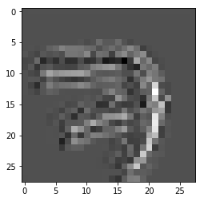
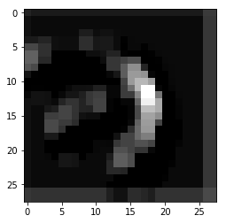

# Visualization of the output of a Convolutional Layer

In this notebook I will show you how to visualize the output of two Convolutional Neural Network (CNN) layers using tensorflow. In addition, you will see some of the filters.  
First we import tensorflow, numpy for matrix shape manipulation and pyplot for the visualization.


```python
import tensorflow as tf
import numpy as np
import matplotlib.pyplot as plt

```

Then we will import the MNIST dataset. Don't worry we will manipulate the data so you could be able to repeat this process with your own data.


```python
#https://www.tensorflow.org/get_started/mnist/beginners

from tensorflow.examples.tutorials.mnist import input_data
mnist = input_data.read_data_sets("MNIST_data/", one_hot=True)
```

    Successfully downloaded train-images-idx3-ubyte.gz 9912422 bytes.
    Extracting MNIST_data/train-images-idx3-ubyte.gz
    Successfully downloaded train-labels-idx1-ubyte.gz 28881 bytes.
    Extracting MNIST_data/train-labels-idx1-ubyte.gz
    Successfully downloaded t10k-images-idx3-ubyte.gz 1648877 bytes.
    Extracting MNIST_data/t10k-images-idx3-ubyte.gz
    Successfully downloaded t10k-labels-idx1-ubyte.gz 4542 bytes.
    Extracting MNIST_data/t10k-labels-idx1-ubyte.gz


The previous cell downloads the training, validation and test sets of images into the variable **mnist**. We can see this by calling help, within the **"Data descriptors zone"**.


```python
print(help(mnist))
```

    Help on Datasets in module tensorflow.contrib.learn.python.learn.datasets.base object:
    
    class Datasets(builtins.tuple)
     |  Datasets(train, validation, test)
     |  
     |  Method resolution order:
     |      Datasets
     |      builtins.tuple
     |      builtins.object
     |  
     |  Methods defined here:
     |  
     |  __getnewargs__(self)
     |      Return self as a plain tuple.  Used by copy and pickle.
     |  
     |  __repr__(self)
     |      Return a nicely formatted representation string
     |  
     |  _asdict(self)
     |      Return a new OrderedDict which maps field names to their values.
     |  
     |  _replace(_self, **kwds)
     |      Return a new Datasets object replacing specified fields with new values
     |  
     |  ----------------------------------------------------------------------
     |  Class methods defined here:
     |  
     |  _make(iterable, new=<built-in method __new__ of type object at 0x7fe83619aae0>, len=<built-in function len>) from builtins.type
     |      Make a new Datasets object from a sequence or iterable
     |  
     |  ----------------------------------------------------------------------
     |  Static methods defined here:
     |  
     |  __new__(_cls, train, validation, test)
     |      Create new instance of Datasets(train, validation, test)
     |  
     |  ----------------------------------------------------------------------
     |  Data descriptors defined here:
     |  
     |  test
     |      Alias for field number 2
     |  
     |  train
     |      Alias for field number 0
     |  
     |  validation
     |      Alias for field number 1
     |  
     |  ----------------------------------------------------------------------
     |  Data and other attributes defined here:
     |  
     |  _fields = ('train', 'validation', 'test')
     |  
     |  _source = "from builtins import property as _property, tupl..._itemget...
     |  
     |  ----------------------------------------------------------------------
     |  Methods inherited from builtins.tuple:
     |  
     |  __add__(self, value, /)
     |      Return self+value.
     |  
     |  __contains__(self, key, /)
     |      Return key in self.
     |  
     |  __eq__(self, value, /)
     |      Return self==value.
     |  
     |  __ge__(self, value, /)
     |      Return self>=value.
     |  
     |  __getattribute__(self, name, /)
     |      Return getattr(self, name).
     |  
     |  __getitem__(self, key, /)
     |      Return self[key].
     |  
     |  __gt__(self, value, /)
     |      Return self>value.
     |  
     |  __hash__(self, /)
     |      Return hash(self).
     |  
     |  __iter__(self, /)
     |      Implement iter(self).
     |  
     |  __le__(self, value, /)
     |      Return self<=value.
     |  
     |  __len__(self, /)
     |      Return len(self).
     |  
     |  __lt__(self, value, /)
     |      Return self<value.
     |  
     |  __mul__(self, value, /)
     |      Return self*value.n
     |  
     |  __ne__(self, value, /)
     |      Return self!=value.
     |  
     |  __rmul__(self, value, /)
     |      Return self*value.
     |  
     |  count(...)
     |      T.count(value) -> integer -- return number of occurrences of value
     |  
     |  index(...)
     |      T.index(value, [start, [stop]]) -> integer -- return first index of value.
     |      Raises ValueError if the value is not present.
    
    None


To see how to work with these data we call help again and see that the training set has **images** and **labels**, what we need for now.


```python
print(help(mnist.train))
```

    Help on DataSet in module tensorflow.contrib.learn.python.learn.datasets.mnist object:
    
    class DataSet(builtins.object)
     |  Methods defined here:
     |  
     |  __init__(self, images, labels, fake_data=False, one_hot=False, dtype=tf.float32, reshape=True, seed=None)
     |      Construct a DataSet.
     |      one_hot arg is used only if fake_data is true.  `dtype` can be either
     |      `uint8` to leave the input as `[0, 255]`, or `float32` to rescale into
     |      `[0, 1]`.  Seed arg provides for convenient deterministic testing.
     |  
     |  next_batch(self, batch_size, fake_data=False, shuffle=True)
     |      Return the next `batch_size` examples from this data set.
     |  
     |  ----------------------------------------------------------------------
     |  Data descriptors defined here:
     |  
     |  __dict__
     |      dictionary for instance variables (if defined)
     |  
     |  __weakref__
     |      list of weak references to the object (if defined)
     |  
     |  epochs_completed
     |  
     |  images
     |  
     |  labels
     |  
     |  num_examples
    
    None


Then we see how many data we have here.


```python
print(mnist.train.images.shape)
print(mnist.train.labels.shape)
```

    (55000, 784)
    (55000, 10)


# The hardest part, definition of layers

Here are three main functions. If more information is required please send me an email or comment if you need further explanation.  
In summary, **get_previous_features** will get all the dimensions of a matrix and compute how many they are. For example if there is [10,256,256,3] matrix, this function will return 256\*256\*3 , we skip the the first dimension **10** because it is for the batch.  
**conv** will create a convolutional layer wi a **relu** activation by default. Some key terms here, **name_scope** and **name**. This two parameters will help us call the declared operations by name. For example, the **tf.nn.conv2d** with name **conv** for a name_scope=**CL1** could be called **CL1/conv**, technically **CL1/conv:0**. In addition, to get the trained weights, **CL1/W**/**CL1/W:0**.   
**fc** will return a fully connected layer, if the name scope is declared as **FCL** it corresponds to the output layer.  
**is_training**: This variable will tell to normalize the layers with its corresponding meand and variance and store them Exponential Moving Average (EMA) the values for normalization or load this EMA to normalize prediciton or testing inputs.


```python

def get_previous_features(i_layer):
    convx_dims = i_layer.get_shape().as_list()
    output_features = 1
    for dim in range(1,len(convx_dims)):
        output_features=output_features*convx_dims[dim]
    return output_features


def conv(input_matrix,filter_size=3,layer_depth=8,
              strides=[1,1,1,1],padding='SAME',
              is_training=True,name_scope="lx",
              stddev_n = 0.05,
             max_bool=False,max_kernel=[1,2,2,1],max_strides=[1,1,1,1], max_padding='SAME',
             drop_out_bool=False,drop_out_ph=None,drop_out_v=None,decay=0.5
             ):
    with tf.name_scope(name_scope):
        ims = input_matrix.get_shape().as_list()
        input_depth=ims[len(ims)-1]
        W = tf.Variable(tf.truncated_normal([filter_size,filter_size,input_depth,layer_depth], stddev=stddev_n),name='W')
        b = tf.Variable(tf.constant(stddev_n, shape=[layer_depth]),name='b')
        c = tf.add(tf.nn.conv2d(input_matrix, W, strides=strides, padding=padding),b,name='conv')
        n = tf.contrib.layers.batch_norm(c, center=True, scale=True, is_training=is_training,decay=decay)
        a = tf.nn.relu(n,name="activation")
        if max_bool==True:
            out = tf.nn.max_pool(a, ksize=max_kernel,strides=max_strides, padding=max_padding,name='max')
        else:
            out = a
        if drop_out_bool==True:
            out_  = tf.nn.dropout(out, drop_out_ph)
        else:
            out_ = out
        return out_


def fc(input_matrix,n=22,norm=False,prev_conv=False,
       stddev_n = 0.05,is_training=True,
       name_scope='FC',drop_out_bool=False,drop_out_ph=None,drop_out_v=None,decay=0.5):
    with tf.name_scope(name_scope):
        cvpfx = get_previous_features(input_matrix)
        if prev_conv==True:
            im = tf.reshape(input_matrix, [-1, cvpfx])
        else:
            im = input_matrix
        W = tf.Variable(tf.truncated_normal([cvpfx, n], stddev=stddev_n),name='W')
        b = tf.Variable(tf.constant(stddev_n, shape=[n]),name='b') 
        fc = tf.add(tf.matmul(im, W),b,name="FC")
        if name_scope=="FCL":
            out_ = fc
        else:
            if norm==True:
                n = tf.contrib.layers.batch_norm(fc, center=True, scale=True, is_training=is_training,decay=decay)
                out = tf.nn.relu(n,name="activation")
            else:
                out = tf.nn.relu(fc,name="activation")
            if drop_out_bool==True:
                out_  = tf.nn.dropout(out, drop_out_ph)
            else:
                out_ = out
        return out_

```

Here we define our model and the way to train it. We have some basic blocks, the placeholders that will be set by an outside call. The shapes of the place holders will be modified by what you feed into it.  
We define if we want to save the model and if we want to restore the model for training. Please notice that we set the name_scope **CL1** and **CL2**.


```python
def train(ix,iy,iters=10,lr=0.001,save_model=True,save_name=None,restore_model=False,restore_name=None,v=False):
    "v: for verbosity"
    tf.reset_default_graph()
    class_output = iy.shape[1]
    d0 = ix.shape[0]
    x_shape=[None]
    for _ in range(1,len(ix.shape)):
        x_shape.append(ix.shape[_])
    xi = tf.placeholder(tf.float32, shape=x_shape,name='x')
    y_ = tf.placeholder(tf.float32, shape=[None,class_output],name='y')
    train_bool=tf.placeholder(bool,name='train_test')
    learning_rate = tf.placeholder(tf.float32)
    
    #Define the model here--DOWN
    CV1 = conv(xi,filter_size=3,layer_depth=2,name_scope="CL1",is_training=train_bool)
    CV2 = conv(CV1,filter_size=3,layer_depth=2,name_scope="CL2",is_training=train_bool)
    prediction = fc(CV2,n=10,name_scope="FCL",prev_conv=True)
    #Define the model here--UP
    
    y_CNN = tf.nn.softmax(prediction,name='Softmax')
    class_pred = tf.argmax(y_CNN,1,name='ClassPred')
    loss = tf.reduce_mean(-tf.reduce_sum(y_ * tf.log(y_CNN), reduction_indices=[1]),name="loss")
    
    #The following three lines are required to make "is_training" work for normalization
    update_ops = tf.get_collection(tf.GraphKeys.UPDATE_OPS)
    with tf.control_dependencies(update_ops):
        train_step = tf.train.AdamOptimizer(learning_rate).minimize(loss)
    init_op = tf.global_variables_initializer()
    
    saver = tf.train.Saver()
    with tf.Session() as s:
        if restore_model==True:
            if restore_name==None:
                print("No model file specified")
                return
            else:
                saver.restore(s,restore_dir)
        else:
            s.run(init_op)
        fd={xi:ix,y_:iy,learning_rate:lr,train_bool:True}
        for _ in range(0,iters):
            _t,l = s.run([train_step,loss],feed_dict=fd)
            if v==True:
                print("Iter:",_,"Loss:",l)
            
        if save_model==True:
            if save_name==None:
                print("No model specified, model not being saved")
                return
            else:
                save_path = saver.save(s, save_name)
                print("Model saved in file: %s" % save_name)

```

Here we modify the mnist data to have a shape of [batch_size,image_with,image_height,channels] where channels is 1, because it is in grayscale.  
We define the model where to save as **base_model**


```python
base_model = 'MNIST/mnist_01_.ckpt'

mtx = mnist.train.images
mtx_s = mtx.shape
x_train = np.reshape(mtx,[mtx_s[0],int(mtx_s[1]**0.5),int(mtx_s[1]**0.5),1])
print("Train shape",mtx_s)
print(x_train.shape)

limit = 16
shift = 0
y_train = mnist.train.labels

xt = x_train[shift:shift+limit,:]
yt = y_train[shift:shift+limit,:]

train(ix=xt,iy=yt,iters=10,lr=0.001,save_model=True,save_name=base_model,restore_model=False,restore_name=None)
```

    Train shape (55000, 784)
    (55000, 28, 28, 1)
    Model saved in file: MNIST/mnist_01_.ckpt


In the previous cell we trained only for 10 iterations on purpose to see the base state of the results of these layers and the weights.  
The next cell is the function that will allow us to call the output whether it is the convolution operation or the weights. The **var_name** is for this purpose.


```python
def restore_see_layer(ix,model_name=None,var_name=None):
    with tf.Session('', tf.Graph()) as s:
        with s.graph.as_default():
            if (model_name!=None) and var_name!=None:
                saver = tf.train.import_meta_graph(model_name+".meta")
                saver.restore(s,model_name)
                fd={'x:0':ix,'train_test:0':False}
                var_name=var_name+":0"
                result = s.run(var_name,feed_dict=fd)
    return result
```

Here we call out function and see the shape of the output.  
the **test_img** will hold our test image from the mnist dataset. Instead of doing xt[0,:], we do xt[0:1,:] to keep the shape [1,28,28,1], otherwise we will get a [28,28] matrix.  
As we can see as we declared in our model, we got **2** depth channels for the CL1 and CL2 convs.  


```python
test_img = xt[0:1,:]

output_cl1 = restore_see_layer(ix=test_img,model_name=base_model,var_name='CL1/conv')
print(output_cl1.shape)

output_cl2 = restore_see_layer(ix=test_img,model_name=base_model,var_name='CL2/conv')
print(output_cl2.shape)

```

    INFO:tensorflow:Restoring parameters from MNIST/mnist_01_.ckpt
    (1, 28, 28, 2)
    INFO:tensorflow:Restoring parameters from MNIST/mnist_01_.ckpt
    (1, 28, 28, 2)


# Let's visualize them!

Now we define a function to ease the visualization for the output. The **depth_filter_to_see** will select with channel of the depth of the output we want to see. Each one will provide a different result.  


```python
def see_output(iNp,depth_filter_to_see=0,cmap="gray",figsize=(4,4)):
    img_x = iNp[0,:,:,depth_filter_to_see]
    fig = plt.figure(figsize=figsize)
    plt.imshow(img_x,cmap=cmap)
    plt.show()

see_output(output_cl1,1)
see_output(output_cl2,1)

```


As we saw, the outputs are different.  
Now, what happens after 1000 iterations?  


```python
train(ix=xt,iy=yt,iters=1000,lr=0.001,save_model=True,save_name=base_model,restore_model=False,restore_name=None,v=True)
```

    Iter: 0 Loss: 2.79147
    Iter: 1 Loss: 2.32892
    Iter: 2 Loss: 1.93102
    Iter: 3 Loss: 1.59006
    Iter: 4 Loss: 1.29672
    Iter: 5 Loss: 1.0444
    Iter: 6 Loss: 0.827575
    Iter: 7 Loss: 0.644254
    Iter: 8 Loss: 0.491302
    Iter: 9 Loss: 0.367425
    Iter: 10 Loss: 0.270061
    Iter: 11 Loss: 0.196526
    Iter: 12 Loss: 0.142641
    Iter: 13 Loss: 0.103913
    Iter: 14 Loss: 0.0763166
    Iter: 15 Loss: 0.0567833
    Iter: 16 Loss: 0.0429254
    Iter: 17 Loss: 0.0330122
    Iter: 18 Loss: 0.0258093
    Iter: 19 Loss: 0.0205094
    Iter: 20 Loss: 0.0165604
    Iter: 21 Loss: 0.0136019
    Iter: 22 Loss: 0.0113298
    Iter: 23 Loss: 0.00956494
    Iter: 24 Loss: 0.00818789
    Iter: 25 Loss: 0.00709464
    Iter: 26 Loss: 0.00621003
    Iter: 27 Loss: 0.00549146
    Iter: 28 Loss: 0.00490289
    Iter: 29 Loss: 0.00441662
    Iter: 30 Loss: 0.00401183
    Iter: 31 Loss: 0.00367067
    Iter: 32 Loss: 0.0033806
    Iter: 33 Loss: 0.00313209
    Iter: 34 Loss: 0.00291907
    Iter: 35 Loss: 0.00273428
    Iter: 36 Loss: 0.00257343
    Iter: 37 Loss: 0.00243271
    Iter: 38 Loss: 0.00230909
    Iter: 39 Loss: 0.00219957
    Iter: 40 Loss: 0.00210301
    Iter: 41 Loss: 0.00201761
    Iter: 42 Loss: 0.0019409
    Iter: 43 Loss: 0.00187205
    Iter: 44 Loss: 0.0018095
    Iter: 45 Loss: 0.00175297
    Iter: 46 Loss: 0.00170218
    Iter: 47 Loss: 0.00165538
    Iter: 48 Loss: 0.00161267
    Iter: 49 Loss: 0.00157371
    Iter: 50 Loss: 0.00153789
    Iter: 51 Loss: 0.00150475
    Iter: 52 Loss: 0.00147431
    Iter: 53 Loss: 0.00144554
    Iter: 54 Loss: 0.00141945
    Iter: 55 Loss: 0.00139532
    Iter: 56 Loss: 0.00137232
    Iter: 57 Loss: 0.00135107
    Iter: 58 Loss: 0.00133096
    Iter: 59 Loss: 0.00131219
    Iter: 60 Loss: 0.00129441
    Iter: 61 Loss: 0.00127788
    Iter: 62 Loss: 0.00126214
    Iter: 63 Loss: 0.00124717
    Iter: 64 Loss: 0.00123284
    Iter: 65 Loss: 0.00121943
    Iter: 66 Loss: 0.00120657
    Iter: 67 Loss: 0.00119388
    Iter: 68 Loss: 0.00118193
    Iter: 69 Loss: 0.00117072
    Iter: 70 Loss: 0.00115962
    Iter: 71 Loss: 0.00114917
    Iter: 72 Loss: 0.00113881
    Iter: 73 Loss: 0.001129
    Iter: 74 Loss: 0.00111943
    Iter: 75 Loss: 0.00111047
    Iter: 76 Loss: 0.00110144
    Iter: 77 Loss: 0.00109292
    Iter: 78 Loss: 0.00108433
    Iter: 79 Loss: 0.0010762
    Iter: 80 Loss: 0.00106812
    Iter: 81 Loss: 0.00106031
    Iter: 82 Loss: 0.00105262
    Iter: 83 Loss: 0.00104506
    Iter: 84 Loss: 0.0010377
    Iter: 85 Loss: 0.00103054
    Iter: 86 Loss: 0.0010231
    Iter: 87 Loss: 0.0010165
    Iter: 88 Loss: 0.00100954
    Iter: 89 Loss: 0.00100272
    Iter: 90 Loss: 0.000996045
    Iter: 91 Loss: 0.000989414
    Iter: 92 Loss: 0.000982995
    Iter: 93 Loss: 0.000976663
    Iter: 94 Loss: 0.000970166
    Iter: 95 Loss: 0.000964105
    Iter: 96 Loss: 0.000957836
    Iter: 97 Loss: 0.000951653
    Iter: 98 Loss: 0.000945704
    Iter: 99 Loss: 0.000939957
    Iter: 100 Loss: 0.000934125
    Iter: 101 Loss: 0.000928274
    Iter: 102 Loss: 0.000922392
    Iter: 103 Loss: 0.000916746
    Iter: 104 Loss: 0.000911369
    Iter: 105 Loss: 0.000905607
    Iter: 106 Loss: 0.000899961
    Iter: 107 Loss: 0.000894349
    Iter: 108 Loss: 0.000888979
    Iter: 109 Loss: 0.000883475
    Iter: 110 Loss: 0.00087824
    Iter: 111 Loss: 0.000872922
    Iter: 112 Loss: 0.000867638
    Iter: 113 Loss: 0.000862317
    Iter: 114 Loss: 0.00085704
    Iter: 115 Loss: 0.000852197
    Iter: 116 Loss: 0.000847028
    Iter: 117 Loss: 0.000841894
    Iter: 118 Loss: 0.000836767
    Iter: 119 Loss: 0.000831949
    Iter: 120 Loss: 0.000827031
    Iter: 121 Loss: 0.000822165
    Iter: 122 Loss: 0.0008175
    Iter: 123 Loss: 0.000812712
    Iter: 124 Loss: 0.000807973
    Iter: 125 Loss: 0.000803424
    Iter: 126 Loss: 0.000798856
    Iter: 127 Loss: 0.000794304
    Iter: 128 Loss: 0.000789729
    Iter: 129 Loss: 0.000785094
    Iter: 130 Loss: 0.000780605
    Iter: 131 Loss: 0.000776186
    Iter: 132 Loss: 0.000771716
    Iter: 133 Loss: 0.000767305
    Iter: 134 Loss: 0.00076295
    Iter: 135 Loss: 0.000758688
    Iter: 136 Loss: 0.000754445
    Iter: 137 Loss: 0.000750385
    Iter: 138 Loss: 0.000746067
    Iter: 139 Loss: 0.000741959
    Iter: 140 Loss: 0.000737753
    Iter: 141 Loss: 0.000733693
    Iter: 142 Loss: 0.000729618
    Iter: 143 Loss: 0.000725535
    Iter: 144 Loss: 0.000721699
    Iter: 145 Loss: 0.000717683
    Iter: 146 Loss: 0.000713944
    Iter: 147 Loss: 0.000709984
    Iter: 148 Loss: 0.000706058
    Iter: 149 Loss: 0.000702271
    Iter: 150 Loss: 0.000698386
    Iter: 151 Loss: 0.000694643
    Iter: 152 Loss: 0.000690862
    Iter: 153 Loss: 0.000687257
    Iter: 154 Loss: 0.000683473
    Iter: 155 Loss: 0.000679707
    Iter: 156 Loss: 0.000676259
    Iter: 157 Loss: 0.000672549
    Iter: 158 Loss: 0.000669071
    Iter: 159 Loss: 0.000665499
    Iter: 160 Loss: 0.000661921
    Iter: 161 Loss: 0.000658673
    Iter: 162 Loss: 0.000655109
    Iter: 163 Loss: 0.000651665
    Iter: 164 Loss: 0.00064825
    Iter: 165 Loss: 0.000644827
    Iter: 166 Loss: 0.000641528
    Iter: 167 Loss: 0.000638124
    Iter: 168 Loss: 0.000634941
    Iter: 169 Loss: 0.000631545
    Iter: 170 Loss: 0.000628305
    Iter: 171 Loss: 0.000625017
    Iter: 172 Loss: 0.000621804
    Iter: 173 Loss: 0.000618463
    Iter: 174 Loss: 0.000615373
    Iter: 175 Loss: 0.000612245
    Iter: 176 Loss: 0.000609114
    Iter: 177 Loss: 0.000606061
    Iter: 178 Loss: 0.00060303
    Iter: 179 Loss: 0.000599973
    Iter: 180 Loss: 0.000596812
    Iter: 181 Loss: 0.000593837
    Iter: 182 Loss: 0.000590829
    Iter: 183 Loss: 0.000587795
    Iter: 184 Loss: 0.000584872
    Iter: 185 Loss: 0.000582128
    Iter: 186 Loss: 0.000579072
    Iter: 187 Loss: 0.000576097
    Iter: 188 Loss: 0.00057323
    Iter: 189 Loss: 0.0005703
    Iter: 190 Loss: 0.00056746
    Iter: 191 Loss: 0.000564612
    Iter: 192 Loss: 0.000561764
    Iter: 193 Loss: 0.000559017
    Iter: 194 Loss: 0.000556385
    Iter: 195 Loss: 0.000553701
    Iter: 196 Loss: 0.000551055
    Iter: 197 Loss: 0.000548348
    Iter: 198 Loss: 0.000545538
    Iter: 199 Loss: 0.000542869
    Iter: 200 Loss: 0.000540293
    Iter: 201 Loss: 0.000537717
    Iter: 202 Loss: 0.000535048
    Iter: 203 Loss: 0.000532529
    Iter: 204 Loss: 0.000529949
    Iter: 205 Loss: 0.000527355
    Iter: 206 Loss: 0.000524883
    Iter: 207 Loss: 0.00052236
    Iter: 208 Loss: 0.000519847
    Iter: 209 Loss: 0.00051738
    Iter: 210 Loss: 0.000514793
    Iter: 211 Loss: 0.000512381
    Iter: 212 Loss: 0.000509914
    Iter: 213 Loss: 0.000507469
    Iter: 214 Loss: 0.000505087
    Iter: 215 Loss: 0.000502716
    Iter: 216 Loss: 0.000500338
    Iter: 217 Loss: 0.00049793
    Iter: 218 Loss: 0.000495735
    Iter: 219 Loss: 0.000493364
    Iter: 220 Loss: 0.000491076
    Iter: 221 Loss: 0.000488757
    Iter: 222 Loss: 0.000486387
    Iter: 223 Loss: 0.000484135
    Iter: 224 Loss: 0.000481951
    Iter: 225 Loss: 0.000479722
    Iter: 226 Loss: 0.000477471
    Iter: 227 Loss: 0.00047529
    Iter: 228 Loss: 0.000473121
    Iter: 229 Loss: 0.00047103
    Iter: 230 Loss: 0.000468779
    Iter: 231 Loss: 0.000466684
    Iter: 232 Loss: 0.000464451
    Iter: 233 Loss: 0.000462331
    Iter: 234 Loss: 0.000460229
    Iter: 235 Loss: 0.000458145
    Iter: 236 Loss: 0.000456021
    Iter: 237 Loss: 0.000453989
    Iter: 238 Loss: 0.000451902
    Iter: 239 Loss: 0.000449908
    Iter: 240 Loss: 0.000447877
    Iter: 241 Loss: 0.000445849
    Iter: 242 Loss: 0.000443862
    Iter: 243 Loss: 0.00044195
    Iter: 244 Loss: 0.000439968
    Iter: 245 Loss: 0.000438007
    Iter: 246 Loss: 0.000436062
    Iter: 247 Loss: 0.000434131
    Iter: 248 Loss: 0.00043223
    Iter: 249 Loss: 0.000430318
    Iter: 250 Loss: 0.000428425
    Iter: 251 Loss: 0.000426524
    Iter: 252 Loss: 0.000424649
    Iter: 253 Loss: 0.000422711
    Iter: 254 Loss: 0.000420825
    Iter: 255 Loss: 0.000419029
    Iter: 256 Loss: 0.000417102
    Iter: 257 Loss: 0.000415365
    Iter: 258 Loss: 0.000413509
    Iter: 259 Loss: 0.00041172
    Iter: 260 Loss: 0.000409883
    Iter: 261 Loss: 0.000408098
    Iter: 262 Loss: 0.000406376
    Iter: 263 Loss: 0.000404631
    Iter: 264 Loss: 0.000402973
    Iter: 265 Loss: 0.000401169
    Iter: 266 Loss: 0.00039944
    Iter: 267 Loss: 0.000397748
    Iter: 268 Loss: 0.000396033
    Iter: 269 Loss: 0.000394341
    Iter: 270 Loss: 0.000392627
    Iter: 271 Loss: 0.000391002
    Iter: 272 Loss: 0.000389269
    Iter: 273 Loss: 0.000387629
    Iter: 274 Loss: 0.000386019
    Iter: 275 Loss: 0.000384417
    Iter: 276 Loss: 0.000382769
    Iter: 277 Loss: 0.000381241
    Iter: 278 Loss: 0.000379601
    Iter: 279 Loss: 0.000378018
    Iter: 280 Loss: 0.00037643
    Iter: 281 Loss: 0.000374798
    Iter: 282 Loss: 0.000373307
    Iter: 283 Loss: 0.000371712
    Iter: 284 Loss: 0.000370184
    Iter: 285 Loss: 0.000368641
    Iter: 286 Loss: 0.000367098
    Iter: 287 Loss: 0.000365682
    Iter: 288 Loss: 0.000364139
    Iter: 289 Loss: 0.000362656
    Iter: 290 Loss: 0.000361176
    Iter: 291 Loss: 0.000359726
    Iter: 292 Loss: 0.000358243
    Iter: 293 Loss: 0.000356767
    Iter: 294 Loss: 0.000355262
    Iter: 295 Loss: 0.000353838
    Iter: 296 Loss: 0.000352332
    Iter: 297 Loss: 0.000350924
    Iter: 298 Loss: 0.000349485
    Iter: 299 Loss: 0.000348125
    Iter: 300 Loss: 0.000346679
    Iter: 301 Loss: 0.00034527
    Iter: 302 Loss: 0.00034391
    Iter: 303 Loss: 0.000342546
    Iter: 304 Loss: 0.000341197
    Iter: 305 Loss: 0.000339863
    Iter: 306 Loss: 0.000338611
    Iter: 307 Loss: 0.000337209
    Iter: 308 Loss: 0.000335845
    Iter: 309 Loss: 0.000334534
    Iter: 310 Loss: 0.000333192
    Iter: 311 Loss: 0.000331955
    Iter: 312 Loss: 0.000330587
    Iter: 313 Loss: 0.000329339
    Iter: 314 Loss: 0.000328049
    Iter: 315 Loss: 0.000326681
    Iter: 316 Loss: 0.000325422
    Iter: 317 Loss: 0.000324162
    Iter: 318 Loss: 0.00032291
    Iter: 319 Loss: 0.000321651
    Iter: 320 Loss: 0.000320383
    Iter: 321 Loss: 0.00031915
    Iter: 322 Loss: 0.000317887
    Iter: 323 Loss: 0.00031662
    Iter: 324 Loss: 0.000315416
    Iter: 325 Loss: 0.000314238
    Iter: 326 Loss: 0.000313008
    Iter: 327 Loss: 0.000311782
    Iter: 328 Loss: 0.000310642
    Iter: 329 Loss: 0.000309464
    Iter: 330 Loss: 0.000308399
    Iter: 331 Loss: 0.000307154
    Iter: 332 Loss: 0.000305965
    Iter: 333 Loss: 0.000304803
    Iter: 334 Loss: 0.000303632
    Iter: 335 Loss: 0.000302477
    Iter: 336 Loss: 0.000301344
    Iter: 337 Loss: 0.000300219
    Iter: 338 Loss: 0.000299138
    Iter: 339 Loss: 0.000297961
    Iter: 340 Loss: 0.000296895
    Iter: 341 Loss: 0.000295784
    Iter: 342 Loss: 0.000294689
    Iter: 343 Loss: 0.000293556
    Iter: 344 Loss: 0.00029246
    Iter: 345 Loss: 0.000291391
    Iter: 346 Loss: 0.000290318
    Iter: 347 Loss: 0.000289229
    Iter: 348 Loss: 0.000288208
    Iter: 349 Loss: 0.000287098
    Iter: 350 Loss: 0.000286107
    Iter: 351 Loss: 0.000285078
    Iter: 352 Loss: 0.000284027
    Iter: 353 Loss: 0.000282939
    Iter: 354 Loss: 0.000281903
    Iter: 355 Loss: 0.000280845
    Iter: 356 Loss: 0.000279854
    Iter: 357 Loss: 0.000278956
    Iter: 358 Loss: 0.000277957
    Iter: 359 Loss: 0.00027698
    Iter: 360 Loss: 0.000276004
    Iter: 361 Loss: 0.000274968
    Iter: 362 Loss: 0.000273962
    Iter: 363 Loss: 0.000273023
    Iter: 364 Loss: 0.000272069
    Iter: 365 Loss: 0.000271089
    Iter: 366 Loss: 0.000270187
    Iter: 367 Loss: 0.000269233
    Iter: 368 Loss: 0.000268272
    Iter: 369 Loss: 0.000267348
    Iter: 370 Loss: 0.00026636
    Iter: 371 Loss: 0.000265421
    Iter: 372 Loss: 0.000264478
    Iter: 373 Loss: 0.000263502
    Iter: 374 Loss: 0.000262608
    Iter: 375 Loss: 0.000261669
    Iter: 376 Loss: 0.000260849
    Iter: 377 Loss: 0.000259895
    Iter: 378 Loss: 0.000259038
    Iter: 379 Loss: 0.000258173
    Iter: 380 Loss: 0.000257257
    Iter: 381 Loss: 0.000256392
    Iter: 382 Loss: 0.000255505
    Iter: 383 Loss: 0.000254719
    Iter: 384 Loss: 0.00025381
    Iter: 385 Loss: 0.00025296
    Iter: 386 Loss: 0.000252096
    Iter: 387 Loss: 0.000251261
    Iter: 388 Loss: 0.000250348
    Iter: 389 Loss: 0.000249543
    Iter: 390 Loss: 0.000248682
    Iter: 391 Loss: 0.000247825
    Iter: 392 Loss: 0.000246991
    Iter: 393 Loss: 0.000246178
    Iter: 394 Loss: 0.000245366
    Iter: 395 Loss: 0.000244539
    Iter: 396 Loss: 0.000243689
    Iter: 397 Loss: 0.000242869
    Iter: 398 Loss: 0.000242087
    Iter: 399 Loss: 0.000241267
    Iter: 400 Loss: 0.00024047
    Iter: 401 Loss: 0.000239672
    Iter: 402 Loss: 0.000238886
    Iter: 403 Loss: 0.000238126
    Iter: 404 Loss: 0.000237306
    Iter: 405 Loss: 0.000236546
    Iter: 406 Loss: 0.000235771
    Iter: 407 Loss: 0.00023504
    Iter: 408 Loss: 0.000234236
    Iter: 409 Loss: 0.00023346
    Iter: 410 Loss: 0.000232775
    Iter: 411 Loss: 0.000231992
    Iter: 412 Loss: 0.000231225
    Iter: 413 Loss: 0.000230457
    Iter: 414 Loss: 0.000229757
    Iter: 415 Loss: 0.000228989
    Iter: 416 Loss: 0.000228274
    Iter: 417 Loss: 0.000227536
    Iter: 418 Loss: 0.000226817
    Iter: 419 Loss: 0.000226094
    Iter: 420 Loss: 0.000225356
    Iter: 421 Loss: 0.000224637
    Iter: 422 Loss: 0.000223929
    Iter: 423 Loss: 0.000223176
    Iter: 424 Loss: 0.000222498
    Iter: 425 Loss: 0.000221723
    Iter: 426 Loss: 0.000221026
    Iter: 427 Loss: 0.000220363
    Iter: 428 Loss: 0.00021964
    Iter: 429 Loss: 0.000218947
    Iter: 430 Loss: 0.000218261
    Iter: 431 Loss: 0.00021759
    Iter: 432 Loss: 0.000216927
    Iter: 433 Loss: 0.000216212
    Iter: 434 Loss: 0.000215519
    Iter: 435 Loss: 0.000214811
    Iter: 436 Loss: 0.000214147
    Iter: 437 Loss: 0.000213536
    Iter: 438 Loss: 0.000212843
    Iter: 439 Loss: 0.000212165
    Iter: 440 Loss: 0.000211494
    Iter: 441 Loss: 0.000210883
    Iter: 442 Loss: 0.000210198
    Iter: 443 Loss: 0.000209557
    Iter: 444 Loss: 0.000208931
    Iter: 445 Loss: 0.000208297
    Iter: 446 Loss: 0.000207642
    Iter: 447 Loss: 0.000206971
    Iter: 448 Loss: 0.00020639
    Iter: 449 Loss: 0.000205726
    Iter: 450 Loss: 0.000205048
    Iter: 451 Loss: 0.000204422
    Iter: 452 Loss: 0.000203833
    Iter: 453 Loss: 0.000203185
    Iter: 454 Loss: 0.000202559
    Iter: 455 Loss: 0.000201929
    Iter: 456 Loss: 0.000201296
    Iter: 457 Loss: 0.000200745
    Iter: 458 Loss: 0.0002001
    Iter: 459 Loss: 0.000199489
    Iter: 460 Loss: 0.000198863
    Iter: 461 Loss: 0.000198252
    Iter: 462 Loss: 0.000197641
    Iter: 463 Loss: 0.000197048
    Iter: 464 Loss: 0.000196512
    Iter: 465 Loss: 0.000195938
    Iter: 466 Loss: 0.000195271
    Iter: 467 Loss: 0.000194772
    Iter: 468 Loss: 0.00019422
    Iter: 469 Loss: 0.000193609
    Iter: 470 Loss: 0.00019305
    Iter: 471 Loss: 0.000192461
    Iter: 472 Loss: 0.00019185
    Iter: 473 Loss: 0.000191269
    Iter: 474 Loss: 0.000190747
    Iter: 475 Loss: 0.000190166
    Iter: 476 Loss: 0.000189563
    Iter: 477 Loss: 0.000188992
    Iter: 478 Loss: 0.000188448
    Iter: 479 Loss: 0.000187852
    Iter: 480 Loss: 0.000187293
    Iter: 481 Loss: 0.000186824
    Iter: 482 Loss: 0.00018628
    Iter: 483 Loss: 0.000185736
    Iter: 484 Loss: 0.000185125
    Iter: 485 Loss: 0.000184659
    Iter: 486 Loss: 0.000184108
    Iter: 487 Loss: 0.000183549
    Iter: 488 Loss: 0.000183027
    Iter: 489 Loss: 0.000182498
    Iter: 490 Loss: 0.000181932
    Iter: 491 Loss: 0.000181406
    Iter: 492 Loss: 0.000180862
    Iter: 493 Loss: 0.000180318
    Iter: 494 Loss: 0.000179774
    Iter: 495 Loss: 0.000179282
    Iter: 496 Loss: 0.000178738
    Iter: 497 Loss: 0.000178261
    Iter: 498 Loss: 0.000177717
    Iter: 499 Loss: 0.000177248
    Iter: 500 Loss: 0.000176711
    Iter: 501 Loss: 0.000176212
    Iter: 502 Loss: 0.000175694
    Iter: 503 Loss: 0.000175225
    Iter: 504 Loss: 0.000174718
    Iter: 505 Loss: 0.000174256
    Iter: 506 Loss: 0.000173734
    Iter: 507 Loss: 0.00017322
    Iter: 508 Loss: 0.000172698
    Iter: 509 Loss: 0.000172177
    Iter: 510 Loss: 0.000171707
    Iter: 511 Loss: 0.000171208
    Iter: 512 Loss: 0.000170709
    Iter: 513 Loss: 0.000170277
    Iter: 514 Loss: 0.000169807
    Iter: 515 Loss: 0.000169271
    Iter: 516 Loss: 0.000168823
    Iter: 517 Loss: 0.000168384
    Iter: 518 Loss: 0.000167862
    Iter: 519 Loss: 0.000167393
    Iter: 520 Loss: 0.00016696
    Iter: 521 Loss: 0.000166446
    Iter: 522 Loss: 0.000166014
    Iter: 523 Loss: 0.000165537
    Iter: 524 Loss: 0.000165075
    Iter: 525 Loss: 0.000164576
    Iter: 526 Loss: 0.000164159
    Iter: 527 Loss: 0.000163682
    Iter: 528 Loss: 0.00016322
    Iter: 529 Loss: 0.00016278
    Iter: 530 Loss: 0.000162318
    Iter: 531 Loss: 0.000161848
    Iter: 532 Loss: 0.000161401
    Iter: 533 Loss: 0.000161006
    Iter: 534 Loss: 0.000160544
    Iter: 535 Loss: 0.000160157
    Iter: 536 Loss: 0.000159717
    Iter: 537 Loss: 0.000159248
    Iter: 538 Loss: 0.000158793
    Iter: 539 Loss: 0.000158406
    Iter: 540 Loss: 0.000157936
    Iter: 541 Loss: 0.000157511
    Iter: 542 Loss: 0.000157057
    Iter: 543 Loss: 0.000156647
    Iter: 544 Loss: 0.000156252
    Iter: 545 Loss: 0.000155786
    Iter: 546 Loss: 0.000155373
    Iter: 547 Loss: 0.000154941
    Iter: 548 Loss: 0.000154523
    Iter: 549 Loss: 0.000154136
    Iter: 550 Loss: 0.000153726
    Iter: 551 Loss: 0.000153294
    Iter: 552 Loss: 0.000152899
    Iter: 553 Loss: 0.000152496
    Iter: 554 Loss: 0.000152064
    Iter: 555 Loss: 0.000151684
    Iter: 556 Loss: 0.000151252
    Iter: 557 Loss: 0.000150835
    Iter: 558 Loss: 0.000150477
    Iter: 559 Loss: 0.000150067
    Iter: 560 Loss: 0.00014962
    Iter: 561 Loss: 0.000149262
    Iter: 562 Loss: 0.000148882
    Iter: 563 Loss: 0.000148487
    Iter: 564 Loss: 0.000148092
    Iter: 565 Loss: 0.000147712
    Iter: 566 Loss: 0.000147295
    Iter: 567 Loss: 0.000146922
    Iter: 568 Loss: 0.000146527
    Iter: 569 Loss: 0.000146118
    Iter: 570 Loss: 0.000145745
    Iter: 571 Loss: 0.000145335
    Iter: 572 Loss: 0.000144955
    Iter: 573 Loss: 0.000144605
    Iter: 574 Loss: 0.000144202
    Iter: 575 Loss: 0.000143822
    Iter: 576 Loss: 0.000143495
    Iter: 577 Loss: 0.000143115
    Iter: 578 Loss: 0.000142727
    Iter: 579 Loss: 0.000142421
    Iter: 580 Loss: 0.000142012
    Iter: 581 Loss: 0.000141632
    Iter: 582 Loss: 0.000141289
    Iter: 583 Loss: 0.000140931
    Iter: 584 Loss: 0.000140596
    Iter: 585 Loss: 0.000140208
    Iter: 586 Loss: 0.000139821
    Iter: 587 Loss: 0.000139471
    Iter: 588 Loss: 0.00013912
    Iter: 589 Loss: 0.000138763
    Iter: 590 Loss: 0.000138364
    Iter: 591 Loss: 0.000138029
    Iter: 592 Loss: 0.000137649
    Iter: 593 Loss: 0.000137306
    Iter: 594 Loss: 0.000136926
    Iter: 595 Loss: 0.000136591
    Iter: 596 Loss: 0.00013624
    Iter: 597 Loss: 0.000135897
    Iter: 598 Loss: 0.000135555
    Iter: 599 Loss: 0.000135197
    Iter: 600 Loss: 0.000134832
    Iter: 601 Loss: 0.000134541
    Iter: 602 Loss: 0.000134169
    Iter: 603 Loss: 0.000133841
    Iter: 604 Loss: 0.00013352
    Iter: 605 Loss: 0.000133185
    Iter: 606 Loss: 0.00013282
    Iter: 607 Loss: 0.0001325
    Iter: 608 Loss: 0.000132134
    Iter: 609 Loss: 0.000131814
    Iter: 610 Loss: 0.000131464
    Iter: 611 Loss: 0.000131136
    Iter: 612 Loss: 0.000130771
    Iter: 613 Loss: 0.000130458
    Iter: 614 Loss: 0.0001301
    Iter: 615 Loss: 0.000129802
    Iter: 616 Loss: 0.000129482
    Iter: 617 Loss: 0.000129154
    Iter: 618 Loss: 0.000128871
    Iter: 619 Loss: 0.000128498
    Iter: 620 Loss: 0.000128215
    Iter: 621 Loss: 0.000127909
    Iter: 622 Loss: 0.000127581
    Iter: 623 Loss: 0.000127283
    Iter: 624 Loss: 0.000126941
    Iter: 625 Loss: 0.00012662
    Iter: 626 Loss: 0.0001263
    Iter: 627 Loss: 0.000125964
    Iter: 628 Loss: 0.000125659
    Iter: 629 Loss: 0.000125331
    Iter: 630 Loss: 0.000125018
    Iter: 631 Loss: 0.000124731
    Iter: 632 Loss: 0.000124403
    Iter: 633 Loss: 0.000124113
    Iter: 634 Loss: 0.000123785
    Iter: 635 Loss: 0.000123442
    Iter: 636 Loss: 0.000123189
    Iter: 637 Loss: 0.00012292
    Iter: 638 Loss: 0.000122585
    Iter: 639 Loss: 0.000122272
    Iter: 640 Loss: 0.000122004
    Iter: 641 Loss: 0.000121706
    Iter: 642 Loss: 0.000121408
    Iter: 643 Loss: 0.000121132
    Iter: 644 Loss: 0.000120782
    Iter: 645 Loss: 0.000120506
    Iter: 646 Loss: 0.000120193
    Iter: 647 Loss: 0.000119917
    Iter: 648 Loss: 0.000119552
    Iter: 649 Loss: 0.000119314
    Iter: 650 Loss: 0.000119053
    Iter: 651 Loss: 0.00011871
    Iter: 652 Loss: 0.00011842
    Iter: 653 Loss: 0.000118099
    Iter: 654 Loss: 0.000117861
    Iter: 655 Loss: 0.000117563
    Iter: 656 Loss: 0.000117309
    Iter: 657 Loss: 0.000117011
    Iter: 658 Loss: 0.000116736
    Iter: 659 Loss: 0.000116445
    Iter: 660 Loss: 0.000116199
    Iter: 661 Loss: 0.000115856
    Iter: 662 Loss: 0.000115566
    Iter: 663 Loss: 0.00011532
    Iter: 664 Loss: 0.000115014
    Iter: 665 Loss: 0.000114746
    Iter: 666 Loss: 0.000114478
    Iter: 667 Loss: 0.00011418
    Iter: 668 Loss: 0.000113941
    Iter: 669 Loss: 0.000113669
    Iter: 670 Loss: 0.000113412
    Iter: 671 Loss: 0.000113159
    Iter: 672 Loss: 0.000112913
    Iter: 673 Loss: 0.000112608
    Iter: 674 Loss: 0.00011228
    Iter: 675 Loss: 0.000112071
    Iter: 676 Loss: 0.000111766
    Iter: 677 Loss: 0.000111512
    Iter: 678 Loss: 0.000111236
    Iter: 679 Loss: 0.000110953
    Iter: 680 Loss: 0.0001107
    Iter: 681 Loss: 0.000110439
    Iter: 682 Loss: 0.000110156
    Iter: 683 Loss: 0.000109895
    Iter: 684 Loss: 0.000109649
    Iter: 685 Loss: 0.000109403
    Iter: 686 Loss: 0.000109105
    Iter: 687 Loss: 0.000108852
    Iter: 688 Loss: 0.000108636
    Iter: 689 Loss: 0.000108383
    Iter: 690 Loss: 0.000108099
    Iter: 691 Loss: 0.000107876
    Iter: 692 Loss: 0.000107608
    Iter: 693 Loss: 0.000107354
    Iter: 694 Loss: 0.000107086
    Iter: 695 Loss: 0.000106848
    Iter: 696 Loss: 0.000106587
    Iter: 697 Loss: 0.000106326
    Iter: 698 Loss: 0.00010605
    Iter: 699 Loss: 0.000105812
    Iter: 700 Loss: 0.000105581
    Iter: 701 Loss: 0.000105335
    Iter: 702 Loss: 0.000105096
    Iter: 703 Loss: 0.000104828
    Iter: 704 Loss: 0.000104575
    Iter: 705 Loss: 0.000104359
    Iter: 706 Loss: 0.00010412
    Iter: 707 Loss: 0.000103897
    Iter: 708 Loss: 0.000103643
    Iter: 709 Loss: 0.00010342
    Iter: 710 Loss: 0.000103174
    Iter: 711 Loss: 0.000102921
    Iter: 712 Loss: 0.000102675
    Iter: 713 Loss: 0.000102429
    Iter: 714 Loss: 0.000102198
    Iter: 715 Loss: 0.000101952
    Iter: 716 Loss: 0.000101721
    Iter: 717 Loss: 0.000101497
    Iter: 718 Loss: 0.000101252
    Iter: 719 Loss: 0.000101035
    Iter: 720 Loss: 0.000100767
    Iter: 721 Loss: 0.000100521
    Iter: 722 Loss: 0.000100342
    Iter: 723 Loss: 0.000100149
    Iter: 724 Loss: 9.98507e-05
    Iter: 725 Loss: 9.96271e-05
    Iter: 726 Loss: 9.94259e-05
    Iter: 727 Loss: 9.91875e-05
    Iter: 728 Loss: 9.89639e-05
    Iter: 729 Loss: 9.8718e-05
    Iter: 730 Loss: 9.85094e-05
    Iter: 731 Loss: 9.82561e-05
    Iter: 732 Loss: 9.80325e-05
    Iter: 733 Loss: 9.7809e-05
    Iter: 734 Loss: 9.76003e-05
    Iter: 735 Loss: 9.73395e-05
    Iter: 736 Loss: 9.70862e-05
    Iter: 737 Loss: 9.68775e-05
    Iter: 738 Loss: 9.66466e-05
    Iter: 739 Loss: 9.64528e-05
    Iter: 740 Loss: 9.62367e-05
    Iter: 741 Loss: 9.60132e-05
    Iter: 742 Loss: 9.58269e-05
    Iter: 743 Loss: 9.56034e-05
    Iter: 744 Loss: 9.54022e-05
    Iter: 745 Loss: 9.51563e-05
    Iter: 746 Loss: 9.49327e-05
    Iter: 747 Loss: 9.47316e-05
    Iter: 748 Loss: 9.45229e-05
    Iter: 749 Loss: 9.42994e-05
    Iter: 750 Loss: 9.40684e-05
    Iter: 751 Loss: 9.38374e-05
    Iter: 752 Loss: 9.36213e-05
    Iter: 753 Loss: 9.3435e-05
    Iter: 754 Loss: 9.32413e-05
    Iter: 755 Loss: 9.30177e-05
    Iter: 756 Loss: 9.28017e-05
    Iter: 757 Loss: 9.26154e-05
    Iter: 758 Loss: 9.24291e-05
    Iter: 759 Loss: 9.21981e-05
    Iter: 760 Loss: 9.19895e-05
    Iter: 761 Loss: 9.17808e-05
    Iter: 762 Loss: 9.1602e-05
    Iter: 763 Loss: 9.14008e-05
    Iter: 764 Loss: 9.11847e-05
    Iter: 765 Loss: 9.09388e-05
    Iter: 766 Loss: 9.076e-05
    Iter: 767 Loss: 9.05737e-05
    Iter: 768 Loss: 9.03278e-05
    Iter: 769 Loss: 9.01341e-05
    Iter: 770 Loss: 8.99478e-05
    Iter: 771 Loss: 8.97764e-05
    Iter: 772 Loss: 8.95603e-05
    Iter: 773 Loss: 8.93517e-05
    Iter: 774 Loss: 8.91207e-05
    Iter: 775 Loss: 8.89791e-05
    Iter: 776 Loss: 8.87407e-05
    Iter: 777 Loss: 8.85842e-05
    Iter: 778 Loss: 8.83681e-05
    Iter: 779 Loss: 8.81371e-05
    Iter: 780 Loss: 8.79509e-05
    Iter: 781 Loss: 8.77869e-05
    Iter: 782 Loss: 8.75932e-05
    Iter: 783 Loss: 8.7392e-05
    Iter: 784 Loss: 8.7161e-05
    Iter: 785 Loss: 8.69598e-05
    Iter: 786 Loss: 8.6781e-05
    Iter: 787 Loss: 8.65947e-05
    Iter: 788 Loss: 8.63935e-05
    Iter: 789 Loss: 8.62445e-05
    Iter: 790 Loss: 8.60508e-05
    Iter: 791 Loss: 8.58719e-05
    Iter: 792 Loss: 8.56782e-05
    Iter: 793 Loss: 8.54994e-05
    Iter: 794 Loss: 8.52833e-05
    Iter: 795 Loss: 8.51119e-05
    Iter: 796 Loss: 8.49554e-05
    Iter: 797 Loss: 8.47319e-05
    Iter: 798 Loss: 8.45903e-05
    Iter: 799 Loss: 8.43817e-05
    Iter: 800 Loss: 8.41954e-05
    Iter: 801 Loss: 8.39942e-05
    Iter: 802 Loss: 8.37856e-05
    Iter: 803 Loss: 8.36217e-05
    Iter: 804 Loss: 8.34428e-05
    Iter: 805 Loss: 8.32565e-05
    Iter: 806 Loss: 8.30852e-05
    Iter: 807 Loss: 8.29361e-05
    Iter: 808 Loss: 8.27424e-05
    Iter: 809 Loss: 8.25561e-05
    Iter: 810 Loss: 8.24146e-05
    Iter: 811 Loss: 8.22357e-05
    Iter: 812 Loss: 8.20718e-05
    Iter: 813 Loss: 8.1893e-05
    Iter: 814 Loss: 8.16992e-05
    Iter: 815 Loss: 8.15204e-05
    Iter: 816 Loss: 8.13565e-05
    Iter: 817 Loss: 8.11776e-05
    Iter: 818 Loss: 8.10286e-05
    Iter: 819 Loss: 8.08424e-05
    Iter: 820 Loss: 8.0671e-05
    Iter: 821 Loss: 8.05219e-05
    Iter: 822 Loss: 8.03282e-05
    Iter: 823 Loss: 8.01568e-05
    Iter: 824 Loss: 7.9978e-05
    Iter: 825 Loss: 7.98513e-05
    Iter: 826 Loss: 7.968e-05
    Iter: 827 Loss: 7.94937e-05
    Iter: 828 Loss: 7.93149e-05
    Iter: 829 Loss: 7.9218e-05
    Iter: 830 Loss: 7.90093e-05
    Iter: 831 Loss: 7.88529e-05
    Iter: 832 Loss: 7.87038e-05
    Iter: 833 Loss: 7.8525e-05
    Iter: 834 Loss: 7.83909e-05
    Iter: 835 Loss: 7.8227e-05
    Iter: 836 Loss: 7.80332e-05
    Iter: 837 Loss: 7.78842e-05
    Iter: 838 Loss: 7.76979e-05
    Iter: 839 Loss: 7.75713e-05
    Iter: 840 Loss: 7.73999e-05
    Iter: 841 Loss: 7.72434e-05
    Iter: 842 Loss: 7.70422e-05
    Iter: 843 Loss: 7.68932e-05
    Iter: 844 Loss: 7.67293e-05
    Iter: 845 Loss: 7.65952e-05
    Iter: 846 Loss: 7.64238e-05
    Iter: 847 Loss: 7.62822e-05
    Iter: 848 Loss: 7.61555e-05
    Iter: 849 Loss: 7.59543e-05
    Iter: 850 Loss: 7.57904e-05
    Iter: 851 Loss: 7.56638e-05
    Iter: 852 Loss: 7.55296e-05
    Iter: 853 Loss: 7.53359e-05
    Iter: 854 Loss: 7.52167e-05
    Iter: 855 Loss: 7.50826e-05
    Iter: 856 Loss: 7.48963e-05
    Iter: 857 Loss: 7.47473e-05
    Iter: 858 Loss: 7.45908e-05
    Iter: 859 Loss: 7.44716e-05
    Iter: 860 Loss: 7.43076e-05
    Iter: 861 Loss: 7.41512e-05
    Iter: 862 Loss: 7.4017e-05
    Iter: 863 Loss: 7.38606e-05
    Iter: 864 Loss: 7.36817e-05
    Iter: 865 Loss: 7.35178e-05
    Iter: 866 Loss: 7.33837e-05
    Iter: 867 Loss: 7.32421e-05
    Iter: 868 Loss: 7.30931e-05
    Iter: 869 Loss: 7.29143e-05
    Iter: 870 Loss: 7.27876e-05
    Iter: 871 Loss: 7.2646e-05
    Iter: 872 Loss: 7.25194e-05
    Iter: 873 Loss: 7.23629e-05
    Iter: 874 Loss: 7.2199e-05
    Iter: 875 Loss: 7.20723e-05
    Iter: 876 Loss: 7.19531e-05
    Iter: 877 Loss: 7.18264e-05
    Iter: 878 Loss: 7.16625e-05
    Iter: 879 Loss: 7.14911e-05
    Iter: 880 Loss: 7.13644e-05
    Iter: 881 Loss: 7.12378e-05
    Iter: 882 Loss: 7.10813e-05
    Iter: 883 Loss: 7.0977e-05
    Iter: 884 Loss: 7.08279e-05
    Iter: 885 Loss: 7.06715e-05
    Iter: 886 Loss: 7.05001e-05
    Iter: 887 Loss: 7.03511e-05
    Iter: 888 Loss: 7.02542e-05
    Iter: 889 Loss: 7.00754e-05
    Iter: 890 Loss: 6.99636e-05
    Iter: 891 Loss: 6.98295e-05
    Iter: 892 Loss: 6.96954e-05
    Iter: 893 Loss: 6.95612e-05
    Iter: 894 Loss: 6.93824e-05
    Iter: 895 Loss: 6.92483e-05
    Iter: 896 Loss: 6.91365e-05
    Iter: 897 Loss: 6.89875e-05
    Iter: 898 Loss: 6.88906e-05
    Iter: 899 Loss: 6.87118e-05
    Iter: 900 Loss: 6.8615e-05
    Iter: 901 Loss: 6.84957e-05
    Iter: 902 Loss: 6.83244e-05
    Iter: 903 Loss: 6.81753e-05
    Iter: 904 Loss: 6.8071e-05
    Iter: 905 Loss: 6.7922e-05
    Iter: 906 Loss: 6.77581e-05
    Iter: 907 Loss: 6.76761e-05
    Iter: 908 Loss: 6.7542e-05
    Iter: 909 Loss: 6.74004e-05
    Iter: 910 Loss: 6.72738e-05
    Iter: 911 Loss: 6.71322e-05
    Iter: 912 Loss: 6.69608e-05
    Iter: 913 Loss: 6.68565e-05
    Iter: 914 Loss: 6.67298e-05
    Iter: 915 Loss: 6.65882e-05
    Iter: 916 Loss: 6.64765e-05
    Iter: 917 Loss: 6.63349e-05
    Iter: 918 Loss: 6.61933e-05
    Iter: 919 Loss: 6.6089e-05
    Iter: 920 Loss: 6.59996e-05
    Iter: 921 Loss: 6.58431e-05
    Iter: 922 Loss: 6.57165e-05
    Iter: 923 Loss: 6.55898e-05
    Iter: 924 Loss: 6.5478e-05
    Iter: 925 Loss: 6.53439e-05
    Iter: 926 Loss: 6.5247e-05
    Iter: 927 Loss: 6.51055e-05
    Iter: 928 Loss: 6.49639e-05
    Iter: 929 Loss: 6.48447e-05
    Iter: 930 Loss: 6.47329e-05
    Iter: 931 Loss: 6.46063e-05
    Iter: 932 Loss: 6.44796e-05
    Iter: 933 Loss: 6.43902e-05
    Iter: 934 Loss: 6.4256e-05
    Iter: 935 Loss: 6.40996e-05
    Iter: 936 Loss: 6.39953e-05
    Iter: 937 Loss: 6.38537e-05
    Iter: 938 Loss: 6.37792e-05
    Iter: 939 Loss: 6.36525e-05
    Iter: 940 Loss: 6.35184e-05
    Iter: 941 Loss: 6.33917e-05
    Iter: 942 Loss: 6.32502e-05
    Iter: 943 Loss: 6.31011e-05
    Iter: 944 Loss: 6.29745e-05
    Iter: 945 Loss: 6.28627e-05
    Iter: 946 Loss: 6.27658e-05
    Iter: 947 Loss: 6.26466e-05
    Iter: 948 Loss: 6.25498e-05
    Iter: 949 Loss: 6.24603e-05
    Iter: 950 Loss: 6.22815e-05
    Iter: 951 Loss: 6.21846e-05
    Iter: 952 Loss: 6.20654e-05
    Iter: 953 Loss: 6.19686e-05
    Iter: 954 Loss: 6.18344e-05
    Iter: 955 Loss: 6.17301e-05
    Iter: 956 Loss: 6.16184e-05
    Iter: 957 Loss: 6.1529e-05
    Iter: 958 Loss: 6.13874e-05
    Iter: 959 Loss: 6.12831e-05
    Iter: 960 Loss: 6.11266e-05
    Iter: 961 Loss: 6.10372e-05
    Iter: 962 Loss: 6.09552e-05
    Iter: 963 Loss: 6.08211e-05
    Iter: 964 Loss: 6.07019e-05
    Iter: 965 Loss: 6.05901e-05
    Iter: 966 Loss: 6.04784e-05
    Iter: 967 Loss: 6.0374e-05
    Iter: 968 Loss: 6.02846e-05
    Iter: 969 Loss: 6.01505e-05
    Iter: 970 Loss: 6.00089e-05
    Iter: 971 Loss: 5.9927e-05
    Iter: 972 Loss: 5.98003e-05
    Iter: 973 Loss: 5.96736e-05
    Iter: 974 Loss: 5.96066e-05
    Iter: 975 Loss: 5.94725e-05
    Iter: 976 Loss: 5.93607e-05
    Iter: 977 Loss: 5.92713e-05
    Iter: 978 Loss: 5.91595e-05
    Iter: 979 Loss: 5.90254e-05
    Iter: 980 Loss: 5.89211e-05
    Iter: 981 Loss: 5.88317e-05
    Iter: 982 Loss: 5.8705e-05
    Iter: 983 Loss: 5.86379e-05
    Iter: 984 Loss: 5.85262e-05
    Iter: 985 Loss: 5.83995e-05
    Iter: 986 Loss: 5.83101e-05
    Iter: 987 Loss: 5.82132e-05
    Iter: 988 Loss: 5.8094e-05
    Iter: 989 Loss: 5.79822e-05
    Iter: 990 Loss: 5.79003e-05
    Iter: 991 Loss: 5.77811e-05
    Iter: 992 Loss: 5.76842e-05
    Iter: 993 Loss: 5.75724e-05
    Iter: 994 Loss: 5.74905e-05
    Iter: 995 Loss: 5.7334e-05
    Iter: 996 Loss: 5.72371e-05
    Iter: 997 Loss: 5.71254e-05
    Iter: 998 Loss: 5.70211e-05
    Iter: 999 Loss: 5.69391e-05
    Model saved in file: MNIST/mnist_01_.ckpt


We repeat the visulization steps and see that indeed the output is different


```python
output_cl1 = restore_see_layer(ix=test_img,model_name=base_model,var_name='CL1/conv')
print(output_cl1.shape)

output_cl2 = restore_see_layer(ix=test_img,model_name=base_model,var_name='CL2/conv')
print(output_cl2.shape)

see_output(output_cl1,1)
see_output(output_cl2,1)

```

    INFO:tensorflow:Restoring parameters from MNIST/mnist_01_.ckpt
    (1, 28, 28, 2)
    INFO:tensorflow:Restoring parameters from MNIST/mnist_01_.ckpt
    (1, 28, 28, 2)





## What about the filters (trained weights)?

Now, the output of the weights have a different shape, [fs,fs,input_depth,output_depth], where **fs** is the filter size. For our model we set the default value as 3. Therefore, our first weight has the shape [3,3,1,2], 1 is the input channel of grayscale of the image and 2 the depth we set. In addition, out second weight has the shape [3,3,2,2], the third parameter is 2, because the channels from the previous layer are 2.  
For this example we are setting this second parameter as 0.  


```python
def see_filter(iNp,depth_filter_to_see=0,input_depth_filter_to_see=0,cmap="gray",figsize=(4,4)):
    img_x = iNp[:,:,input_depth_filter_to_see,depth_filter_to_see]
    fig = plt.figure(figsize=figsize)
    plt.imshow(img_x,cmap=cmap)
    plt.show()


output_cl1_filter = restore_see_layer(ix=test_img,model_name=base_model,var_name='CL1/W')
print(output_cl1_filter.shape)

output_cl2_filter = restore_see_layer(ix=test_img,model_name=base_model,var_name='CL2/W')
print(output_cl2_filter.shape)

see_filter(output_cl1_filter,1)
see_filter(output_cl2_filter,1)
```

    INFO:tensorflow:Restoring parameters from MNIST/mnist_01_.ckpt
    (3, 3, 1, 2)
    INFO:tensorflow:Restoring parameters from MNIST/mnist_01_.ckpt
    (3, 3, 2, 2)


## Do you want to see max pooling ?

Now we define another function **train_max** with the purpose to have a model with max_pool. to enable this with out **conv** function we set **max_bool=True**.  


```python
def train_max(ix,iy,iters=10,lr=0.001,save_model=True,save_name=None,restore_model=False,restore_name=None,v=False):
    "v: for verbosity"
    tf.reset_default_graph()
    class_output = iy.shape[1]
    d0 = ix.shape[0]
    x_shape=[None]
    for _ in range(1,len(ix.shape)):
        x_shape.append(ix.shape[_])
    xi = tf.placeholder(tf.float32, shape=x_shape,name='x')
    y_ = tf.placeholder(tf.float32, shape=[None,class_output],name='y')
    train_bool=tf.placeholder(bool,name='train_test')
    learning_rate = tf.placeholder(tf.float32)
    
    CV1 = conv(xi,filter_size=3,layer_depth=2,name_scope="CL1",is_training=train_bool,max_bool=True)
    CV2 = conv(CV1,filter_size=3,layer_depth=2,name_scope="CL2",is_training=train_bool,max_bool=True)
    prediction = fc(CV2,n=10,name_scope="FCL",prev_conv=True)
    
    y_CNN = tf.nn.softmax(prediction,name='Softmax')
    class_pred = tf.argmax(y_CNN,1,name='ClassPred')
    loss = tf.reduce_mean(-tf.reduce_sum(y_ * tf.log(y_CNN), reduction_indices=[1]),name="loss")
    update_ops = tf.get_collection(tf.GraphKeys.UPDATE_OPS)
    with tf.control_dependencies(update_ops):
        train_step = tf.train.AdamOptimizer(learning_rate).minimize(loss)
    init_op = tf.global_variables_initializer()
    
    saver = tf.train.Saver()
    with tf.Session() as s:
        if restore_model==True:
            if restore_name==None:
                print("No model file specified")
                return
            else:
                saver.restore(s,restore_dir)
        else:
            s.run(init_op)
        fd={xi:ix,y_:iy,learning_rate:lr,train_bool:True}
        for _ in range(0,iters):
            _t,l = s.run([train_step,loss],feed_dict=fd)
            if v==True:
                print("Iter:",_,"Loss:",l)
            
        if save_model==True:
            if save_name==None:
                print("No model specified, model not being saved")
                return
            else:
                save_path = saver.save(s, save_name)
                print("Model saved in file: %s" % save_name)

```

We define our new model where to save the max operations. Afterwards run a bit and see the results


```python
model_max= 'MNIST/model_max2l_.ckpt'
train_max(ix=xt,iy=yt,iters=10,lr=0.001,save_model=True,save_name=model_max,restore_model=False,restore_name=None)
```

    Model saved in file: MNIST/model_max2l_.ckpt


```python
output_cl1 = restore_see_layer(ix=test_img,model_name=model_max,var_name='CL1/max')
print(output_cl1.shape)

output_cl2 = restore_see_layer(ix=test_img,model_name=model_max,var_name='CL2/max')
print(output_cl2.shape)

see_output(output_cl1,1)
see_output(output_cl2,1)

output_cl1_filter = restore_see_layer(ix=test_img,model_name=model_max,var_name='CL1/W')
print(output_cl1_filter.shape)

output_cl2_filter = restore_see_layer(ix=test_img,model_name=model_max,var_name='CL2/W')
print(output_cl2_filter.shape)

see_filter(output_cl1_filter,1)
see_filter(output_cl2_filter,1)
```

    INFO:tensorflow:Restoring parameters from MNIST/model_max2l_.ckpt
    (1, 28, 28, 2)
    INFO:tensorflow:Restoring parameters from MNIST/model_max2l_.ckpt
    (1, 28, 28, 2)


    INFO:tensorflow:Restoring parameters from MNIST/model_max2l_.ckpt
    (3, 3, 1, 2)
    INFO:tensorflow:Restoring parameters from MNIST/model_max2l_.ckpt
    (3, 3, 2, 2)


Let's see what happens after 1000 iterations with max pool


```python
train_max(ix=xt,iy=yt,iters=1000,lr=0.001,save_model=True,save_name=model_max,restore_model=False,restore_name=None,v=True)
```

    Iter: 0 Loss: 2.52325
    Iter: 1 Loss: 2.10588
    Iter: 2 Loss: 1.85213
    Iter: 3 Loss: 1.6767
    Iter: 4 Loss: 1.53139
    Iter: 5 Loss: 1.37711
    Iter: 6 Loss: 1.21062
    Iter: 7 Loss: 1.03148
    Iter: 8 Loss: 0.854594
    Iter: 9 Loss: 0.689051
    Iter: 10 Loss: 0.540909
    Iter: 11 Loss: 0.414639
    Iter: 12 Loss: 0.312772
    Iter: 13 Loss: 0.232099
    Iter: 14 Loss: 0.171793
    Iter: 15 Loss: 0.1282
    Iter: 16 Loss: 0.0964904
    Iter: 17 Loss: 0.0733689
    Iter: 18 Loss: 0.056451
    Iter: 19 Loss: 0.0442356
    Iter: 20 Loss: 0.0351976
    Iter: 21 Loss: 0.0282159
    Iter: 22 Loss: 0.0227603
    Iter: 23 Loss: 0.0185439
    Iter: 24 Loss: 0.0152532
    Iter: 25 Loss: 0.0126556
    Iter: 26 Loss: 0.0106094
    Iter: 27 Loss: 0.00897927
    Iter: 28 Loss: 0.00766731
    Iter: 29 Loss: 0.00660917
    Iter: 30 Loss: 0.00574832
    Iter: 31 Loss: 0.00504796
    Iter: 32 Loss: 0.00447039
    Iter: 33 Loss: 0.00399236
    Iter: 34 Loss: 0.00359128
    Iter: 35 Loss: 0.0032554
    Iter: 36 Loss: 0.00297193
    Iter: 37 Loss: 0.00272861
    Iter: 38 Loss: 0.00252139
    Iter: 39 Loss: 0.00234256
    Iter: 40 Loss: 0.00218749
    Iter: 41 Loss: 0.0020529
    Iter: 42 Loss: 0.00193531
    Iter: 43 Loss: 0.00183152
    Iter: 44 Loss: 0.00173992
    Iter: 45 Loss: 0.00165906
    Iter: 46 Loss: 0.00158652
    Iter: 47 Loss: 0.00152154
    Iter: 48 Loss: 0.00146362
    Iter: 49 Loss: 0.00141055
    Iter: 50 Loss: 0.00136288
    Iter: 51 Loss: 0.00131945
    Iter: 52 Loss: 0.00128057
    Iter: 53 Loss: 0.00124341
    Iter: 54 Loss: 0.00121094
    Iter: 55 Loss: 0.00118117
    Iter: 56 Loss: 0.00115325
    Iter: 57 Loss: 0.001127
    Iter: 58 Loss: 0.00110312
    Iter: 59 Loss: 0.00108091
    Iter: 60 Loss: 0.00106026
    Iter: 61 Loss: 0.00104084
    Iter: 62 Loss: 0.00102277
    Iter: 63 Loss: 0.00100629
    Iter: 64 Loss: 0.000990617
    Iter: 65 Loss: 0.000975428
    Iter: 66 Loss: 0.00096156
    Iter: 67 Loss: 0.000948368
    Iter: 68 Loss: 0.000935455
    Iter: 69 Loss: 0.000923703
    Iter: 70 Loss: 0.00091229
    Iter: 71 Loss: 0.0009016
    Iter: 72 Loss: 0.000891016
    Iter: 73 Loss: 0.000881207
    Iter: 74 Loss: 0.000871372
    Iter: 75 Loss: 0.000862592
    Iter: 76 Loss: 0.000853817
    Iter: 77 Loss: 0.000845426
    Iter: 78 Loss: 0.000837475
    Iter: 79 Loss: 0.000829803
    Iter: 80 Loss: 0.000822277
    Iter: 81 Loss: 0.000814923
    Iter: 82 Loss: 0.000807923
    Iter: 83 Loss: 0.000801121
    Iter: 84 Loss: 0.000794424
    Iter: 85 Loss: 0.000787618
    Iter: 86 Loss: 0.000781279
    Iter: 87 Loss: 0.000775133
    Iter: 88 Loss: 0.000768928
    Iter: 89 Loss: 0.000763133
    Iter: 90 Loss: 0.000757506
    Iter: 91 Loss: 0.000751715
    Iter: 92 Loss: 0.000746241
    Iter: 93 Loss: 0.000740789
    Iter: 94 Loss: 0.000735382
    Iter: 95 Loss: 0.00073021
    Iter: 96 Loss: 0.000725229
    Iter: 97 Loss: 0.000719971
    Iter: 98 Loss: 0.000715057
    Iter: 99 Loss: 0.000710336
    Iter: 100 Loss: 0.000705422
    Iter: 101 Loss: 0.000700593
    Iter: 102 Loss: 0.000696022
    Iter: 103 Loss: 0.000691424
    Iter: 104 Loss: 0.000686894
    Iter: 105 Loss: 0.000682405
    Iter: 106 Loss: 0.000677991
    Iter: 107 Loss: 0.000673628
    Iter: 108 Loss: 0.000669106
    Iter: 109 Loss: 0.000664807
    Iter: 110 Loss: 0.000660627
    Iter: 111 Loss: 0.000656515
    Iter: 112 Loss: 0.000652406
    Iter: 113 Loss: 0.000648413
    Iter: 114 Loss: 0.000644375
    Iter: 115 Loss: 0.000640278
    Iter: 116 Loss: 0.000636386
    Iter: 117 Loss: 0.000632493
    Iter: 118 Loss: 0.000628575
    Iter: 119 Loss: 0.00062469
    Iter: 120 Loss: 0.00062094
    Iter: 121 Loss: 0.000617234
    Iter: 122 Loss: 0.000613495
    Iter: 123 Loss: 0.000609931
    Iter: 124 Loss: 0.00060624
    Iter: 125 Loss: 0.000602598
    Iter: 126 Loss: 0.000599067
    Iter: 127 Loss: 0.000595496
    Iter: 128 Loss: 0.000591898
    Iter: 129 Loss: 0.000588435
    Iter: 130 Loss: 0.000585072
    Iter: 131 Loss: 0.000581706
    Iter: 132 Loss: 0.000578459
    Iter: 133 Loss: 0.000575074
    Iter: 134 Loss: 0.000571827
    Iter: 135 Loss: 0.000568442
    Iter: 136 Loss: 0.000565285
    Iter: 137 Loss: 0.000562161
    Iter: 138 Loss: 0.000558914
    Iter: 139 Loss: 0.000555764
    Iter: 140 Loss: 0.00055267
    Iter: 141 Loss: 0.000549535
    Iter: 142 Loss: 0.000546493
    Iter: 143 Loss: 0.000543443
    Iter: 144 Loss: 0.000540368
    Iter: 145 Loss: 0.000537345
    Iter: 146 Loss: 0.000534363
    Iter: 147 Loss: 0.000531433
    Iter: 148 Loss: 0.000528466
    Iter: 149 Loss: 0.000525558
    Iter: 150 Loss: 0.000522665
    Iter: 151 Loss: 0.000519818
    Iter: 152 Loss: 0.000516962
    Iter: 153 Loss: 0.000514114
    Iter: 154 Loss: 0.000511389
    Iter: 155 Loss: 0.000508471
    Iter: 156 Loss: 0.00050569
    Iter: 157 Loss: 0.000502947
    Iter: 158 Loss: 0.0005003
    Iter: 159 Loss: 0.00049762
    Iter: 160 Loss: 0.000494932
    Iter: 161 Loss: 0.000492286
    Iter: 162 Loss: 0.000489714
    Iter: 163 Loss: 0.000487071
    Iter: 164 Loss: 0.000484477
    Iter: 165 Loss: 0.000481853
    Iter: 166 Loss: 0.00047937
    Iter: 167 Loss: 0.000476832
    Iter: 168 Loss: 0.000474327
    Iter: 169 Loss: 0.000471822
    Iter: 170 Loss: 0.000469355
    Iter: 171 Loss: 0.000466891
    Iter: 172 Loss: 0.00046445
    Iter: 173 Loss: 0.000461979
    Iter: 174 Loss: 0.000459608
    Iter: 175 Loss: 0.000457245
    Iter: 176 Loss: 0.000454859
    Iter: 177 Loss: 0.000452496
    Iter: 178 Loss: 0.00045017
    Iter: 179 Loss: 0.000447852
    Iter: 180 Loss: 0.000445541
    Iter: 181 Loss: 0.000443271
    Iter: 182 Loss: 0.000441046
    Iter: 183 Loss: 0.000438799
    Iter: 184 Loss: 0.000436562
    Iter: 185 Loss: 0.000434326
    Iter: 186 Loss: 0.000432198
    Iter: 187 Loss: 0.000429932
    Iter: 188 Loss: 0.000427833
    Iter: 189 Loss: 0.000425638
    Iter: 190 Loss: 0.000423525
    Iter: 191 Loss: 0.000421408
    Iter: 192 Loss: 0.00041932
    Iter: 193 Loss: 0.000417211
    Iter: 194 Loss: 0.000415165
    Iter: 195 Loss: 0.000413051
    Iter: 196 Loss: 0.000411069
    Iter: 197 Loss: 0.000409041
    Iter: 198 Loss: 0.000407043
    Iter: 199 Loss: 0.000405064
    Iter: 200 Loss: 0.000403074
    Iter: 201 Loss: 0.000401084
    Iter: 202 Loss: 0.000399176
    Iter: 203 Loss: 0.000397185
    Iter: 204 Loss: 0.00039527
    Iter: 205 Loss: 0.000393305
    Iter: 206 Loss: 0.000391435
    Iter: 207 Loss: 0.000389608
    Iter: 208 Loss: 0.000387734
    Iter: 209 Loss: 0.000385855
    Iter: 210 Loss: 0.000384036
    Iter: 211 Loss: 0.000382113
    Iter: 212 Loss: 0.000380287
    Iter: 213 Loss: 0.000378532
    Iter: 214 Loss: 0.000376624
    Iter: 215 Loss: 0.00037482
    Iter: 216 Loss: 0.000373061
    Iter: 217 Loss: 0.000371305
    Iter: 218 Loss: 0.00036961
    Iter: 219 Loss: 0.000367903
    Iter: 220 Loss: 0.000366151
    Iter: 221 Loss: 0.000364496
    Iter: 222 Loss: 0.000362864
    Iter: 223 Loss: 0.000361168
    Iter: 224 Loss: 0.000359469
    Iter: 225 Loss: 0.000357784
    Iter: 226 Loss: 0.000356163
    Iter: 227 Loss: 0.000354441
    Iter: 228 Loss: 0.000352876
    Iter: 229 Loss: 0.000351273
    Iter: 230 Loss: 0.000349701
    Iter: 231 Loss: 0.000348098
    Iter: 232 Loss: 0.000346496
    Iter: 233 Loss: 0.00034499
    Iter: 234 Loss: 0.00034344
    Iter: 235 Loss: 0.00034183
    Iter: 236 Loss: 0.000340339
    Iter: 237 Loss: 0.000338759
    Iter: 238 Loss: 0.000337212
    Iter: 239 Loss: 0.000335774
    Iter: 240 Loss: 0.000334279
    Iter: 241 Loss: 0.000332766
    Iter: 242 Loss: 0.000331335
    Iter: 243 Loss: 0.000329852
    Iter: 244 Loss: 0.00032838
    Iter: 245 Loss: 0.000326956
    Iter: 246 Loss: 0.000325533
    Iter: 247 Loss: 0.000324064
    Iter: 248 Loss: 0.000322693
    Iter: 249 Loss: 0.000321269
    Iter: 250 Loss: 0.000319793
    Iter: 251 Loss: 0.000318403
    Iter: 252 Loss: 0.000317032
    Iter: 253 Loss: 0.000315579
    Iter: 254 Loss: 0.000314244
    Iter: 255 Loss: 0.000312858
    Iter: 256 Loss: 0.000311524
    Iter: 257 Loss: 0.000310216
    Iter: 258 Loss: 0.000308885
    Iter: 259 Loss: 0.000307522
    Iter: 260 Loss: 0.000306195
    Iter: 261 Loss: 0.000304876
    Iter: 262 Loss: 0.000303515
    Iter: 263 Loss: 0.000302233
    Iter: 264 Loss: 0.000300959
    Iter: 265 Loss: 0.00029964
    Iter: 266 Loss: 0.000298335
    Iter: 267 Loss: 0.000297083
    Iter: 268 Loss: 0.000295839
    Iter: 269 Loss: 0.000294527
    Iter: 270 Loss: 0.000293297
    Iter: 271 Loss: 0.000292052
    Iter: 272 Loss: 0.000290856
    Iter: 273 Loss: 0.000289589
    Iter: 274 Loss: 0.000288359
    Iter: 275 Loss: 0.000287167
    Iter: 276 Loss: 0.000285922
    Iter: 277 Loss: 0.000284834
    Iter: 278 Loss: 0.000283623
    Iter: 279 Loss: 0.000282445
    Iter: 280 Loss: 0.000281298
    Iter: 281 Loss: 0.000280075
    Iter: 282 Loss: 0.00027895
    Iter: 283 Loss: 0.000277825
    Iter: 284 Loss: 0.000276669
    Iter: 285 Loss: 0.000275492
    Iter: 286 Loss: 0.000274344
    Iter: 287 Loss: 0.000273196
    Iter: 288 Loss: 0.000272082
    Iter: 289 Loss: 0.000270964
    Iter: 290 Loss: 0.000269854
    Iter: 291 Loss: 0.000268773
    Iter: 292 Loss: 0.000267662
    Iter: 293 Loss: 0.000266556
    Iter: 294 Loss: 0.00026546
    Iter: 295 Loss: 0.000264379
    Iter: 296 Loss: 0.000263344
    Iter: 297 Loss: 0.000262218
    Iter: 298 Loss: 0.000261197
    Iter: 299 Loss: 0.000260139
    Iter: 300 Loss: 0.000259058
    Iter: 301 Loss: 0.000258015
    Iter: 302 Loss: 0.000256949
    Iter: 303 Loss: 0.000255943
    Iter: 304 Loss: 0.000254952
    Iter: 305 Loss: 0.000253912
    Iter: 306 Loss: 0.000252906
    Iter: 307 Loss: 0.00025187
    Iter: 308 Loss: 0.000250949
    Iter: 309 Loss: 0.000249846
    Iter: 310 Loss: 0.000248874
    Iter: 311 Loss: 0.000247886
    Iter: 312 Loss: 0.000246955
    Iter: 313 Loss: 0.000245978
    Iter: 314 Loss: 0.000244943
    Iter: 315 Loss: 0.000244018
    Iter: 316 Loss: 0.000243072
    Iter: 317 Loss: 0.000242073
    Iter: 318 Loss: 0.000241127
    Iter: 319 Loss: 0.00024018
    Iter: 320 Loss: 0.000239256
    Iter: 321 Loss: 0.00023841
    Iter: 322 Loss: 0.000237486
    Iter: 323 Loss: 0.000236536
    Iter: 324 Loss: 0.000235634
    Iter: 325 Loss: 0.000234747
    Iter: 326 Loss: 0.000233838
    Iter: 327 Loss: 0.000232944
    Iter: 328 Loss: 0.000232057
    Iter: 329 Loss: 0.000231118
    Iter: 330 Loss: 0.000230239
    Iter: 331 Loss: 0.000229419
    Iter: 332 Loss: 0.000228517
    Iter: 333 Loss: 0.000227638
    Iter: 334 Loss: 0.000226795
    Iter: 335 Loss: 0.000225957
    Iter: 336 Loss: 0.00022516
    Iter: 337 Loss: 0.000224265
    Iter: 338 Loss: 0.000223464
    Iter: 339 Loss: 0.000222622
    Iter: 340 Loss: 0.000221758
    Iter: 341 Loss: 0.00022099
    Iter: 342 Loss: 0.000220185
    Iter: 343 Loss: 0.000219332
    Iter: 344 Loss: 0.00021856
    Iter: 345 Loss: 0.000217748
    Iter: 346 Loss: 0.000216928
    Iter: 347 Loss: 0.000216138
    Iter: 348 Loss: 0.000215345
    Iter: 349 Loss: 0.000214599
    Iter: 350 Loss: 0.000213795
    Iter: 351 Loss: 0.000213049
    Iter: 352 Loss: 0.000212278
    Iter: 353 Loss: 0.00021151
    Iter: 354 Loss: 0.000210743
    Iter: 355 Loss: 0.000209968
    Iter: 356 Loss: 0.000209208
    Iter: 357 Loss: 0.00020847
    Iter: 358 Loss: 0.000207769
    Iter: 359 Loss: 0.000207024
    Iter: 360 Loss: 0.000206309
    Iter: 361 Loss: 0.000205578
    Iter: 362 Loss: 0.000204833
    Iter: 363 Loss: 0.000204073
    Iter: 364 Loss: 0.00020335
    Iter: 365 Loss: 0.000202664
    Iter: 366 Loss: 0.000201942
    Iter: 367 Loss: 0.000201316
    Iter: 368 Loss: 0.000200615
    Iter: 369 Loss: 0.000199915
    Iter: 370 Loss: 0.000199192
    Iter: 371 Loss: 0.000198499
    Iter: 372 Loss: 0.000197798
    Iter: 373 Loss: 0.000197112
    Iter: 374 Loss: 0.000196419
    Iter: 375 Loss: 0.000195764
    Iter: 376 Loss: 0.000195026
    Iter: 377 Loss: 0.000194411
    Iter: 378 Loss: 0.000193718
    Iter: 379 Loss: 0.00019307
    Iter: 380 Loss: 0.000192399
    Iter: 381 Loss: 0.000191758
    Iter: 382 Loss: 0.00019111
    Iter: 383 Loss: 0.000190439
    Iter: 384 Loss: 0.000189783
    Iter: 385 Loss: 0.000189187
    Iter: 386 Loss: 0.000188531
    Iter: 387 Loss: 0.00018789
    Iter: 388 Loss: 0.000187287
    Iter: 389 Loss: 0.000186623
    Iter: 390 Loss: 0.000185968
    Iter: 391 Loss: 0.000185357
    Iter: 392 Loss: 0.000184716
    Iter: 393 Loss: 0.000184105
    Iter: 394 Loss: 0.000183531
    Iter: 395 Loss: 0.000182912
    Iter: 396 Loss: 0.000182361
    Iter: 397 Loss: 0.00018169
    Iter: 398 Loss: 0.000181116
    Iter: 399 Loss: 0.000180513
    Iter: 400 Loss: 0.000179879
    Iter: 401 Loss: 0.000179298
    Iter: 402 Loss: 0.000178702
    Iter: 403 Loss: 0.000178143
    Iter: 404 Loss: 0.000177521
    Iter: 405 Loss: 0.000176954
    Iter: 406 Loss: 0.00017638
    Iter: 407 Loss: 0.000175799
    Iter: 408 Loss: 0.000175218
    Iter: 409 Loss: 0.000174652
    Iter: 410 Loss: 0.000174089
    Iter: 411 Loss: 0.000173537
    Iter: 412 Loss: 0.000172964
    Iter: 413 Loss: 0.000172435
    Iter: 414 Loss: 0.000171816
    Iter: 415 Loss: 0.000171306
    Iter: 416 Loss: 0.000170754
    Iter: 417 Loss: 0.00017018
    Iter: 418 Loss: 0.000169681
    Iter: 419 Loss: 0.00016907
    Iter: 420 Loss: 0.000168526
    Iter: 421 Loss: 0.000168027
    Iter: 422 Loss: 0.000167483
    Iter: 423 Loss: 0.000166954
    Iter: 424 Loss: 0.000166417
    Iter: 425 Loss: 0.000165925
    Iter: 426 Loss: 0.000165366
    Iter: 427 Loss: 0.000164845
    Iter: 428 Loss: 0.000164301
    Iter: 429 Loss: 0.000163749
    Iter: 430 Loss: 0.000163257
    Iter: 431 Loss: 0.000162743
    Iter: 432 Loss: 0.000162199
    Iter: 433 Loss: 0.000161737
    Iter: 434 Loss: 0.000161245
    Iter: 435 Loss: 0.000160739
    Iter: 436 Loss: 0.000160232
    Iter: 437 Loss: 0.000159703
    Iter: 438 Loss: 0.000159226
    Iter: 439 Loss: 0.000158734
    Iter: 440 Loss: 0.000158235
    Iter: 441 Loss: 0.00015775
    Iter: 442 Loss: 0.000157244
    Iter: 443 Loss: 0.000156782
    Iter: 444 Loss: 0.000156267
    Iter: 445 Loss: 0.000155805
    Iter: 446 Loss: 0.000155329
    Iter: 447 Loss: 0.000154889
    Iter: 448 Loss: 0.000154382
    Iter: 449 Loss: 0.000153935
    Iter: 450 Loss: 0.000153428
    Iter: 451 Loss: 0.000152974
    Iter: 452 Loss: 0.000152445
    Iter: 453 Loss: 0.000151968
    Iter: 454 Loss: 0.000151543
    Iter: 455 Loss: 0.000151107
    Iter: 456 Loss: 0.000150623
    Iter: 457 Loss: 0.00015019
    Iter: 458 Loss: 0.000149736
    Iter: 459 Loss: 0.000149289
    Iter: 460 Loss: 0.000148819
    Iter: 461 Loss: 0.000148387
    Iter: 462 Loss: 0.00014794
    Iter: 463 Loss: 0.000147478
    Iter: 464 Loss: 0.000147053
    Iter: 465 Loss: 0.000146643
    Iter: 466 Loss: 0.000146196
    Iter: 467 Loss: 0.000145727
    Iter: 468 Loss: 0.000145317
    Iter: 469 Loss: 0.000144885
    Iter: 470 Loss: 0.000144453
    Iter: 471 Loss: 0.000144024
    Iter: 472 Loss: 0.000143607
    Iter: 473 Loss: 0.000143186
    Iter: 474 Loss: 0.000142768
    Iter: 475 Loss: 0.000142366
    Iter: 476 Loss: 0.000141911
    Iter: 477 Loss: 0.000141517
    Iter: 478 Loss: 0.000141129
    Iter: 479 Loss: 0.000140689
    Iter: 480 Loss: 0.000140294
    Iter: 481 Loss: 0.000139855
    Iter: 482 Loss: 0.00013946
    Iter: 483 Loss: 0.000139057
    Iter: 484 Loss: 0.00013864
    Iter: 485 Loss: 0.000138253
    Iter: 486 Loss: 0.00013785
    Iter: 487 Loss: 0.00013747
    Iter: 488 Loss: 0.000137068
    Iter: 489 Loss: 0.000136695
    Iter: 490 Loss: 0.00013627
    Iter: 491 Loss: 0.000135876
    Iter: 492 Loss: 0.000135488
    Iter: 493 Loss: 0.000135138
    Iter: 494 Loss: 0.000134743
    Iter: 495 Loss: 0.000134355
    Iter: 496 Loss: 0.000133998
    Iter: 497 Loss: 0.000133603
    Iter: 498 Loss: 0.0001332
    Iter: 499 Loss: 0.000132865
    Iter: 500 Loss: 0.000132515
    Iter: 501 Loss: 0.00013212
    Iter: 502 Loss: 0.00013174
    Iter: 503 Loss: 0.000131367
    Iter: 504 Loss: 0.00013098
    Iter: 505 Loss: 0.000130592
    Iter: 506 Loss: 0.00013022
    Iter: 507 Loss: 0.000129877
    Iter: 508 Loss: 0.000129497
    Iter: 509 Loss: 0.000129132
    Iter: 510 Loss: 0.000128774
    Iter: 511 Loss: 0.000128431
    Iter: 512 Loss: 0.000128051
    Iter: 513 Loss: 0.000127694
    Iter: 514 Loss: 0.000127366
    Iter: 515 Loss: 0.000127008
    Iter: 516 Loss: 0.000126688
    Iter: 517 Loss: 0.000126322
    Iter: 518 Loss: 0.000125928
    Iter: 519 Loss: 0.000125607
    Iter: 520 Loss: 0.000125264
    Iter: 521 Loss: 0.000124914
    Iter: 522 Loss: 0.000124564
    Iter: 523 Loss: 0.000124229
    Iter: 524 Loss: 0.000123871
    Iter: 525 Loss: 0.000123536
    Iter: 526 Loss: 0.000123178
    Iter: 527 Loss: 0.000122857
    Iter: 528 Loss: 0.000122552
    Iter: 529 Loss: 0.000122187
    Iter: 530 Loss: 0.000121844
    Iter: 531 Loss: 0.000121531
    Iter: 532 Loss: 0.00012124
    Iter: 533 Loss: 0.000120905
    Iter: 534 Loss: 0.000120614
    Iter: 535 Loss: 0.000120264
    Iter: 536 Loss: 0.000119974
    Iter: 537 Loss: 0.000119653
    Iter: 538 Loss: 0.000119348
    Iter: 539 Loss: 0.000119005
    Iter: 540 Loss: 0.000118632
    Iter: 541 Loss: 0.000118357
    Iter: 542 Loss: 0.000118059
    Iter: 543 Loss: 0.000117686
    Iter: 544 Loss: 0.000117358
    Iter: 545 Loss: 0.00011709
    Iter: 546 Loss: 0.000116777
    Iter: 547 Loss: 0.000116449
    Iter: 548 Loss: 0.000116144
    Iter: 549 Loss: 0.000115801
    Iter: 550 Loss: 0.000115562
    Iter: 551 Loss: 0.000115257
    Iter: 552 Loss: 0.000114959
    Iter: 553 Loss: 0.000114657
    Iter: 554 Loss: 0.000114329
    Iter: 555 Loss: 0.000114046
    Iter: 556 Loss: 0.000113755
    Iter: 557 Loss: 0.000113442
    Iter: 558 Loss: 0.000113159
    Iter: 559 Loss: 0.000112831
    Iter: 560 Loss: 0.000112578
    Iter: 561 Loss: 0.00011225
    Iter: 562 Loss: 0.000111974
    Iter: 563 Loss: 0.000111699
    Iter: 564 Loss: 0.000111416
    Iter: 565 Loss: 0.00011114
    Iter: 566 Loss: 0.000110842
    Iter: 567 Loss: 0.000110566
    Iter: 568 Loss: 0.000110246
    Iter: 569 Loss: 0.000109977
    Iter: 570 Loss: 0.000109724
    Iter: 571 Loss: 0.000109419
    Iter: 572 Loss: 0.000109173
    Iter: 573 Loss: 0.000108875
    Iter: 574 Loss: 0.000108599
    Iter: 575 Loss: 0.000108308
    Iter: 576 Loss: 0.000108033
    Iter: 577 Loss: 0.000107787
    Iter: 578 Loss: 0.000107451
    Iter: 579 Loss: 0.000107235
    Iter: 580 Loss: 0.000106974
    Iter: 581 Loss: 0.000106624
    Iter: 582 Loss: 0.000106423
    Iter: 583 Loss: 0.00010614
    Iter: 584 Loss: 0.000105853
    Iter: 585 Loss: 0.000105622
    Iter: 586 Loss: 0.000105361
    Iter: 587 Loss: 0.000105108
    Iter: 588 Loss: 0.000104795
    Iter: 589 Loss: 0.000104549
    Iter: 590 Loss: 0.000104325
    Iter: 591 Loss: 0.000104005
    Iter: 592 Loss: 0.000103811
    Iter: 593 Loss: 0.000103513
    Iter: 594 Loss: 0.000103215
    Iter: 595 Loss: 0.000102984
    Iter: 596 Loss: 0.000102708
    Iter: 597 Loss: 0.00010244
    Iter: 598 Loss: 0.000102209
    Iter: 599 Loss: 0.000101978
    Iter: 600 Loss: 0.000101703
    Iter: 601 Loss: 0.000101479
    Iter: 602 Loss: 0.000101233
    Iter: 603 Loss: 0.000100972
    Iter: 604 Loss: 0.000100741
    Iter: 605 Loss: 0.000100503
    Iter: 606 Loss: 0.000100242
    Iter: 607 Loss: 9.99589e-05
    Iter: 608 Loss: 9.96906e-05
    Iter: 609 Loss: 9.94671e-05
    Iter: 610 Loss: 9.92733e-05
    Iter: 611 Loss: 9.90386e-05
    Iter: 612 Loss: 9.87704e-05
    Iter: 613 Loss: 9.85394e-05
    Iter: 614 Loss: 9.82786e-05
    Iter: 615 Loss: 9.80699e-05
    Iter: 616 Loss: 9.7839e-05
    Iter: 617 Loss: 9.76154e-05
    Iter: 618 Loss: 9.73621e-05
    Iter: 619 Loss: 9.71236e-05
    Iter: 620 Loss: 9.68852e-05
    Iter: 621 Loss: 9.66691e-05
    Iter: 622 Loss: 9.64306e-05
    Iter: 623 Loss: 9.62294e-05
    Iter: 624 Loss: 9.59687e-05
    Iter: 625 Loss: 9.57004e-05
    Iter: 626 Loss: 9.54992e-05
    Iter: 627 Loss: 9.5298e-05
    Iter: 628 Loss: 9.50447e-05
    Iter: 629 Loss: 9.48435e-05
    Iter: 630 Loss: 9.4605e-05
    Iter: 631 Loss: 9.4389e-05
    Iter: 632 Loss: 9.41505e-05
    Iter: 633 Loss: 9.39493e-05
    Iter: 634 Loss: 9.37034e-05
    Iter: 635 Loss: 9.34948e-05
    Iter: 636 Loss: 9.3234e-05
    Iter: 637 Loss: 9.30403e-05
    Iter: 638 Loss: 9.28391e-05
    Iter: 639 Loss: 9.2623e-05
    Iter: 640 Loss: 9.23547e-05
    Iter: 641 Loss: 9.2161e-05
    Iter: 642 Loss: 9.193e-05
    Iter: 643 Loss: 9.17512e-05
    Iter: 644 Loss: 9.14978e-05
    Iter: 645 Loss: 9.13041e-05
    Iter: 646 Loss: 9.10582e-05
    Iter: 647 Loss: 9.08719e-05
    Iter: 648 Loss: 9.06782e-05
    Iter: 649 Loss: 9.04621e-05
    Iter: 650 Loss: 9.02236e-05
    Iter: 651 Loss: 9.00448e-05
    Iter: 652 Loss: 8.98436e-05
    Iter: 653 Loss: 8.95977e-05
    Iter: 654 Loss: 8.94189e-05
    Iter: 655 Loss: 8.92028e-05
    Iter: 656 Loss: 8.90538e-05
    Iter: 657 Loss: 8.88079e-05
    Iter: 658 Loss: 8.8562e-05
    Iter: 659 Loss: 8.83906e-05
    Iter: 660 Loss: 8.82043e-05
    Iter: 661 Loss: 8.79435e-05
    Iter: 662 Loss: 8.77498e-05
    Iter: 663 Loss: 8.7571e-05
    Iter: 664 Loss: 8.73549e-05
    Iter: 665 Loss: 8.71462e-05
    Iter: 666 Loss: 8.69674e-05
    Iter: 667 Loss: 8.67662e-05
    Iter: 668 Loss: 8.6565e-05
    Iter: 669 Loss: 8.6349e-05
    Iter: 670 Loss: 8.61478e-05
    Iter: 671 Loss: 8.59764e-05
    Iter: 672 Loss: 8.57603e-05
    Iter: 673 Loss: 8.56038e-05
    Iter: 674 Loss: 8.53728e-05
    Iter: 675 Loss: 8.51791e-05
    Iter: 676 Loss: 8.49928e-05
    Iter: 677 Loss: 8.4814e-05
    Iter: 678 Loss: 8.46054e-05
    Iter: 679 Loss: 8.43744e-05
    Iter: 680 Loss: 8.42104e-05
    Iter: 681 Loss: 8.40465e-05
    Iter: 682 Loss: 8.38155e-05
    Iter: 683 Loss: 8.36441e-05
    Iter: 684 Loss: 8.34579e-05
    Iter: 685 Loss: 8.32567e-05
    Iter: 686 Loss: 8.30555e-05
    Iter: 687 Loss: 8.28841e-05
    Iter: 688 Loss: 8.27202e-05
    Iter: 689 Loss: 8.25413e-05
    Iter: 690 Loss: 8.23327e-05
    Iter: 691 Loss: 8.21837e-05
    Iter: 692 Loss: 8.1975e-05
    Iter: 693 Loss: 8.17962e-05
    Iter: 694 Loss: 8.16099e-05
    Iter: 695 Loss: 8.13939e-05
    Iter: 696 Loss: 8.1215e-05
    Iter: 697 Loss: 8.10362e-05
    Iter: 698 Loss: 8.08648e-05
    Iter: 699 Loss: 8.07158e-05
    Iter: 700 Loss: 8.0522e-05
    Iter: 701 Loss: 8.03283e-05
    Iter: 702 Loss: 8.01495e-05
    Iter: 703 Loss: 7.99781e-05
    Iter: 704 Loss: 7.97993e-05
    Iter: 705 Loss: 7.9613e-05
    Iter: 706 Loss: 7.94416e-05
    Iter: 707 Loss: 7.92777e-05
    Iter: 708 Loss: 7.91138e-05
    Iter: 709 Loss: 7.892e-05
    Iter: 710 Loss: 7.87486e-05
    Iter: 711 Loss: 7.85698e-05
    Iter: 712 Loss: 7.84059e-05
    Iter: 713 Loss: 7.82271e-05
    Iter: 714 Loss: 7.80482e-05
    Iter: 715 Loss: 7.78545e-05
    Iter: 716 Loss: 7.77204e-05
    Iter: 717 Loss: 7.7549e-05
    Iter: 718 Loss: 7.73702e-05
    Iter: 719 Loss: 7.72062e-05
    Iter: 720 Loss: 7.70423e-05
    Iter: 721 Loss: 7.68858e-05
    Iter: 722 Loss: 7.6707e-05
    Iter: 723 Loss: 7.65356e-05
    Iter: 724 Loss: 7.63792e-05
    Iter: 725 Loss: 7.61929e-05
    Iter: 726 Loss: 7.60588e-05
    Iter: 727 Loss: 7.58501e-05
    Iter: 728 Loss: 7.57309e-05
    Iter: 729 Loss: 7.55521e-05
    Iter: 730 Loss: 7.53956e-05
    Iter: 731 Loss: 7.52093e-05
    Iter: 732 Loss: 7.50379e-05
    Iter: 733 Loss: 7.4874e-05
    Iter: 734 Loss: 7.4725e-05
    Iter: 735 Loss: 7.45611e-05
    Iter: 736 Loss: 7.44046e-05
    Iter: 737 Loss: 7.42407e-05
    Iter: 738 Loss: 7.40767e-05
    Iter: 739 Loss: 7.39128e-05
    Iter: 740 Loss: 7.37638e-05
    Iter: 741 Loss: 7.36297e-05
    Iter: 742 Loss: 7.34434e-05
    Iter: 743 Loss: 7.32795e-05
    Iter: 744 Loss: 7.31677e-05
    Iter: 745 Loss: 7.29814e-05
    Iter: 746 Loss: 7.28249e-05
    Iter: 747 Loss: 7.2661e-05
    Iter: 748 Loss: 7.25343e-05
    Iter: 749 Loss: 7.23779e-05
    Iter: 750 Loss: 7.22288e-05
    Iter: 751 Loss: 7.20873e-05
    Iter: 752 Loss: 7.19159e-05
    Iter: 753 Loss: 7.17594e-05
    Iter: 754 Loss: 7.15806e-05
    Iter: 755 Loss: 7.14763e-05
    Iter: 756 Loss: 7.13421e-05
    Iter: 757 Loss: 7.11782e-05
    Iter: 758 Loss: 7.10367e-05
    Iter: 759 Loss: 7.08727e-05
    Iter: 760 Loss: 7.07237e-05
    Iter: 761 Loss: 7.05747e-05
    Iter: 762 Loss: 7.04406e-05
    Iter: 763 Loss: 7.0299e-05
    Iter: 764 Loss: 7.01351e-05
    Iter: 765 Loss: 6.9986e-05
    Iter: 766 Loss: 6.98519e-05
    Iter: 767 Loss: 6.97252e-05
    Iter: 768 Loss: 6.95688e-05
    Iter: 769 Loss: 6.94496e-05
    Iter: 770 Loss: 6.92707e-05
    Iter: 771 Loss: 6.9159e-05
    Iter: 772 Loss: 6.90025e-05
    Iter: 773 Loss: 6.8846e-05
    Iter: 774 Loss: 6.87268e-05
    Iter: 775 Loss: 6.85927e-05
    Iter: 776 Loss: 6.84138e-05
    Iter: 777 Loss: 6.83021e-05
    Iter: 778 Loss: 6.81531e-05
    Iter: 779 Loss: 6.79966e-05
    Iter: 780 Loss: 6.7855e-05
    Iter: 781 Loss: 6.77209e-05
    Iter: 782 Loss: 6.75868e-05
    Iter: 783 Loss: 6.74601e-05
    Iter: 784 Loss: 6.7326e-05
    Iter: 785 Loss: 6.7177e-05
    Iter: 786 Loss: 6.70577e-05
    Iter: 787 Loss: 6.69013e-05
    Iter: 788 Loss: 6.6782e-05
    Iter: 789 Loss: 6.66405e-05
    Iter: 790 Loss: 6.64914e-05
    Iter: 791 Loss: 6.6335e-05
    Iter: 792 Loss: 6.62083e-05
    Iter: 793 Loss: 6.60965e-05
    Iter: 794 Loss: 6.5955e-05
    Iter: 795 Loss: 6.58208e-05
    Iter: 796 Loss: 6.56718e-05
    Iter: 797 Loss: 6.55601e-05
    Iter: 798 Loss: 6.54185e-05
    Iter: 799 Loss: 6.53067e-05
    Iter: 800 Loss: 6.51801e-05
    Iter: 801 Loss: 6.50459e-05
    Iter: 802 Loss: 6.49416e-05
    Iter: 803 Loss: 6.47479e-05
    Iter: 804 Loss: 6.46361e-05
    Iter: 805 Loss: 6.45542e-05
    Iter: 806 Loss: 6.43679e-05
    Iter: 807 Loss: 6.4271e-05
    Iter: 808 Loss: 6.41294e-05
    Iter: 809 Loss: 6.40028e-05
    Iter: 810 Loss: 6.38761e-05
    Iter: 811 Loss: 6.37569e-05
    Iter: 812 Loss: 6.36153e-05
    Iter: 813 Loss: 6.3511e-05
    Iter: 814 Loss: 6.34067e-05
    Iter: 815 Loss: 6.32651e-05
    Iter: 816 Loss: 6.31235e-05
    Iter: 817 Loss: 6.30192e-05
    Iter: 818 Loss: 6.28627e-05
    Iter: 819 Loss: 6.27361e-05
    Iter: 820 Loss: 6.26392e-05
    Iter: 821 Loss: 6.25051e-05
    Iter: 822 Loss: 6.24082e-05
    Iter: 823 Loss: 6.23039e-05
    Iter: 824 Loss: 6.21474e-05
    Iter: 825 Loss: 6.20282e-05
    Iter: 826 Loss: 6.19165e-05
    Iter: 827 Loss: 6.17823e-05
    Iter: 828 Loss: 6.16333e-05
    Iter: 829 Loss: 6.15514e-05
    Iter: 830 Loss: 6.14172e-05
    Iter: 831 Loss: 6.13055e-05
    Iter: 832 Loss: 6.11862e-05
    Iter: 833 Loss: 6.10521e-05
    Iter: 834 Loss: 6.09627e-05
    Iter: 835 Loss: 6.08137e-05
    Iter: 836 Loss: 6.07168e-05
    Iter: 837 Loss: 6.06349e-05
    Iter: 838 Loss: 6.0456e-05
    Iter: 839 Loss: 6.04113e-05
    Iter: 840 Loss: 6.02623e-05
    Iter: 841 Loss: 6.01058e-05
    Iter: 842 Loss: 6.00239e-05
    Iter: 843 Loss: 5.99121e-05
    Iter: 844 Loss: 5.98153e-05
    Iter: 845 Loss: 5.9696e-05
    Iter: 846 Loss: 5.95694e-05
    Iter: 847 Loss: 5.94651e-05
    Iter: 848 Loss: 5.93533e-05
    Iter: 849 Loss: 5.92341e-05
    Iter: 850 Loss: 5.91074e-05
    Iter: 851 Loss: 5.89807e-05
    Iter: 852 Loss: 5.88988e-05
    Iter: 853 Loss: 5.87423e-05
    Iter: 854 Loss: 5.86529e-05
    Iter: 855 Loss: 5.85337e-05
    Iter: 856 Loss: 5.84443e-05
    Iter: 857 Loss: 5.83101e-05
    Iter: 858 Loss: 5.82133e-05
    Iter: 859 Loss: 5.81313e-05
    Iter: 860 Loss: 5.79674e-05
    Iter: 861 Loss: 5.78705e-05
    Iter: 862 Loss: 5.77662e-05
    Iter: 863 Loss: 5.76321e-05
    Iter: 864 Loss: 5.75278e-05
    Iter: 865 Loss: 5.74309e-05
    Iter: 866 Loss: 5.7334e-05
    Iter: 867 Loss: 5.72297e-05
    Iter: 868 Loss: 5.70882e-05
    Iter: 869 Loss: 5.70137e-05
    Iter: 870 Loss: 5.69168e-05
    Iter: 871 Loss: 5.67976e-05
    Iter: 872 Loss: 5.66858e-05
    Iter: 873 Loss: 5.65815e-05
    Iter: 874 Loss: 5.64846e-05
    Iter: 875 Loss: 5.63952e-05
    Iter: 876 Loss: 5.62536e-05
    Iter: 877 Loss: 5.61568e-05
    Iter: 878 Loss: 5.60748e-05
    Iter: 879 Loss: 5.59556e-05
    Iter: 880 Loss: 5.58513e-05
    Iter: 881 Loss: 5.57619e-05
    Iter: 882 Loss: 5.56427e-05
    Iter: 883 Loss: 5.55532e-05
    Iter: 884 Loss: 5.54415e-05
    Iter: 885 Loss: 5.53372e-05
    Iter: 886 Loss: 5.5203e-05
    Iter: 887 Loss: 5.51062e-05
    Iter: 888 Loss: 5.50317e-05
    Iter: 889 Loss: 5.49199e-05
    Iter: 890 Loss: 5.48156e-05
    Iter: 891 Loss: 5.47411e-05
    Iter: 892 Loss: 5.4607e-05
    Iter: 893 Loss: 5.45026e-05
    Iter: 894 Loss: 5.44207e-05
    Iter: 895 Loss: 5.42866e-05
    Iter: 896 Loss: 5.41972e-05
    Iter: 897 Loss: 5.41077e-05
    Iter: 898 Loss: 5.40407e-05
    Iter: 899 Loss: 5.39438e-05
    Iter: 900 Loss: 5.38321e-05
    Iter: 901 Loss: 5.37352e-05
    Iter: 902 Loss: 5.36607e-05
    Iter: 903 Loss: 5.35564e-05
    Iter: 904 Loss: 5.34372e-05
    Iter: 905 Loss: 5.33477e-05
    Iter: 906 Loss: 5.3236e-05
    Iter: 907 Loss: 5.31764e-05
    Iter: 908 Loss: 5.30646e-05
    Iter: 909 Loss: 5.29677e-05
    Iter: 910 Loss: 5.28634e-05
    Iter: 911 Loss: 5.27591e-05
    Iter: 912 Loss: 5.26473e-05
    Iter: 913 Loss: 5.25803e-05
    Iter: 914 Loss: 5.24685e-05
    Iter: 915 Loss: 5.23866e-05
    Iter: 916 Loss: 5.22897e-05
    Iter: 917 Loss: 5.21928e-05
    Iter: 918 Loss: 5.20811e-05
    Iter: 919 Loss: 5.20289e-05
    Iter: 920 Loss: 5.19395e-05
    Iter: 921 Loss: 5.18203e-05
    Iter: 922 Loss: 5.17309e-05
    Iter: 923 Loss: 5.16489e-05
    Iter: 924 Loss: 5.15371e-05
    Iter: 925 Loss: 5.14477e-05
    Iter: 926 Loss: 5.13583e-05
    Iter: 927 Loss: 5.12764e-05
    Iter: 928 Loss: 5.12093e-05
    Iter: 929 Loss: 5.11199e-05
    Iter: 930 Loss: 5.09932e-05
    Iter: 931 Loss: 5.09113e-05
    Iter: 932 Loss: 5.08293e-05
    Iter: 933 Loss: 5.07324e-05
    Iter: 934 Loss: 5.06356e-05
    Iter: 935 Loss: 5.05462e-05
    Iter: 936 Loss: 5.04642e-05
    Iter: 937 Loss: 5.03748e-05
    Iter: 938 Loss: 5.02928e-05
    Iter: 939 Loss: 5.0196e-05
    Iter: 940 Loss: 5.00916e-05
    Iter: 941 Loss: 5.00097e-05
    Iter: 942 Loss: 4.99054e-05
    Iter: 943 Loss: 4.98383e-05
    Iter: 944 Loss: 4.97266e-05
    Iter: 945 Loss: 4.9652e-05
    Iter: 946 Loss: 4.95626e-05
    Iter: 947 Loss: 4.94583e-05
    Iter: 948 Loss: 4.93913e-05
    Iter: 949 Loss: 4.93093e-05
    Iter: 950 Loss: 4.9205e-05
    Iter: 951 Loss: 4.91305e-05
    Iter: 952 Loss: 4.90411e-05
    Iter: 953 Loss: 4.8974e-05
    Iter: 954 Loss: 4.88473e-05
    Iter: 955 Loss: 4.87728e-05
    Iter: 956 Loss: 4.86983e-05
    Iter: 957 Loss: 4.86387e-05
    Iter: 958 Loss: 4.85567e-05
    Iter: 959 Loss: 4.84599e-05
    Iter: 960 Loss: 4.8363e-05
    Iter: 961 Loss: 4.82662e-05
    Iter: 962 Loss: 4.81842e-05
    Iter: 963 Loss: 4.80873e-05
    Iter: 964 Loss: 4.80203e-05
    Iter: 965 Loss: 4.79011e-05
    Iter: 966 Loss: 4.7834e-05
    Iter: 967 Loss: 4.7752e-05
    Iter: 968 Loss: 4.76626e-05
    Iter: 969 Loss: 4.75881e-05
    Iter: 970 Loss: 4.75062e-05
    Iter: 971 Loss: 4.74167e-05
    Iter: 972 Loss: 4.73348e-05
    Iter: 973 Loss: 4.72826e-05
    Iter: 974 Loss: 4.72007e-05
    Iter: 975 Loss: 4.71411e-05
    Iter: 976 Loss: 4.70218e-05
    Iter: 977 Loss: 4.69548e-05
    Iter: 978 Loss: 4.68728e-05
    Iter: 979 Loss: 4.6776e-05
    Iter: 980 Loss: 4.67089e-05
    Iter: 981 Loss: 4.66195e-05
    Iter: 982 Loss: 4.65524e-05
    Iter: 983 Loss: 4.64854e-05
    Iter: 984 Loss: 4.6396e-05
    Iter: 985 Loss: 4.6314e-05
    Iter: 986 Loss: 4.62469e-05
    Iter: 987 Loss: 4.6165e-05
    Iter: 988 Loss: 4.60756e-05
    Iter: 989 Loss: 4.6016e-05
    Iter: 990 Loss: 4.58967e-05
    Iter: 991 Loss: 4.58371e-05
    Iter: 992 Loss: 4.57626e-05
    Iter: 993 Loss: 4.56956e-05
    Iter: 994 Loss: 4.55987e-05
    Iter: 995 Loss: 4.55465e-05
    Iter: 996 Loss: 4.54571e-05
    Iter: 997 Loss: 4.53826e-05
    Iter: 998 Loss: 4.53007e-05
    Iter: 999 Loss: 4.52336e-05
    Model saved in file: MNIST/model_max2l_.ckpt


```python
output_cl1 = restore_see_layer(ix=test_img,model_name=model_max,var_name='CL1/max')
print(output_cl1.shape)

output_cl2 = restore_see_layer(ix=test_img,model_name=model_max,var_name='CL2/max')
print(output_cl2.shape)

see_output(output_cl1,1)
see_output(output_cl2,1)

output_cl1_filter = restore_see_layer(ix=test_img,model_name=model_max,var_name='CL1/W')
print(output_cl1_filter.shape)

output_cl2_filter = restore_see_layer(ix=test_img,model_name=model_max,var_name='CL2/W')
print(output_cl2_filter.shape)

see_filter(output_cl1_filter,1)
see_filter(output_cl2_filter,1)
```

    INFO:tensorflow:Restoring parameters from MNIST/model_max2l_.ckpt
    (1, 28, 28, 2)
    INFO:tensorflow:Restoring parameters from MNIST/model_max2l_.ckpt
    (1, 28, 28, 2)





    INFO:tensorflow:Restoring parameters from MNIST/model_max2l_.ckpt
    (3, 3, 1, 2)
    INFO:tensorflow:Restoring parameters from MNIST/model_max2l_.ckpt
    (3, 3, 2, 2)


```python

```
